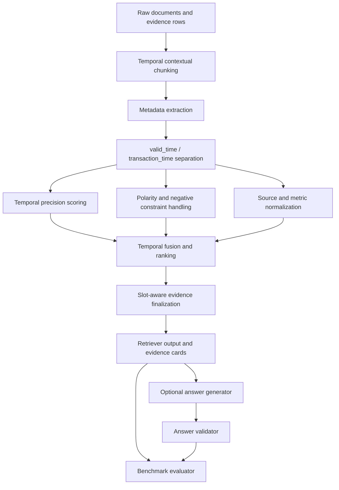

# ChronoRAG

ChronoRAG is a temporal retrieval and grounded answer-validation RAG framework.
It targets temporal failure modes in retrieval-augmented generation: evidence
that is topically relevant but valid at the wrong time, filings or publication
dates mistaken for fact time, broad background rows outranking exact evidence,
and generated answers that cite evidence while misusing its temporal role.

The system separates fact time from publication, filing, release, ingestion, or
other transaction time. It evaluates evidence selection and temporal grounding
under controlled benchmark conditions. ChronoRAG reports controlled benchmark
evidence for temporal retrieval behavior under explicitly scoped datasets and
validators. The claims are limited to the tested settings: temporal retrieval,
evidence selection, answer-contract validation, and component ablation behavior.
The project does not generalize these results beyond the benchmark conditions
without additional evaluation.

## Why Temporal RAG Is Hard

Standard RAG often ranks passages by lexical or semantic relevance. Temporal
questions need more than topical match:

- A row can mention the right entity but the wrong date.
- A filing, publication, or release date can be confused with the time a claim
  was true.
- Broad historical context can outrank exact dated evidence.
- A query can explicitly exclude a nearby date.
- A comparison question can need evidence from multiple time slots.
- A generated answer can cite plausible evidence while violating the requested
  valid-time contract.

ChronoRAG makes these cases explicit in retrieval, evidence finalization, and
answer validation.

## Architecture



Core pieces:

| Component | Role |
|---|---|
| Temporal Contextual Chunking | Preserves raw evidence for grounding while adding structured retrieval text with temporal, entity, unit, source, and document context. |
| `valid_time` / `transaction_time` separation | Keeps when a claim is true separate from when it was filed, published, released, observed, or ingested. |
| Temporal precision scoring | Scores year, month, day, timestamp, range, fuzzy range, quarter, and daypart matches before answer synthesis. |
| Polarity and negative constraints | Treats target dates differently from excluded dates such as `not 1990-03-28`. |
| Source / metric normalization | Rewards source-family, source-file, metric, claim, and version anchors when the question asks for them. |
| Slot-aware finalization | Assembles evidence for comparison and multi-slot questions so one side does not dominate top-k. |
| Answer validation | Checks cited evidence, valid-time use, transaction-time misuse, partial/refusal behavior, and provider-output contracts. |

Provider-backed generation is optional. Retrieval and validation can be run
deterministically without Vertex.

## Evaluation Map

| Layer | Scope | What It Tests | Boundary |
|---|---|---|---|
| Layer 1A | Temporal retrieval benchmark | Whether retrieval finds temporally correct evidence and avoids temporal distractors. | Retrieval-focused only. |
| Layer 1B | Temporal answer validation | Whether generated or light-mode answers satisfy a grounded temporal answer contract. | Answer-contract validation over controlled cases. |
| Layer 2A | Cross-domain retrieval-only benchmark | Whether retrieval behavior holds across a selected cross-domain corpus and v3 aligned questions. | Selected evidence IDs only; no natural-language answer scoring. |
| Layer 2B | Planned natural-language temporal QA | 50 manually designed questions using ChronoRAG + Vertex + dynamic top-k + answer validation. | Future work; answer synthesis and validation after retrieval. |

## Layer 1A: Temporal Eval v2

Layer 1A is a controlled temporal retrieval benchmark. It asks whether the
retriever can select the right evidence when time is part of the query, not just
whether it can find a semantically related passage.

It tests exact valid-time retrieval, wrong-year and wrong-time traps, broad
window distractors, valid-time versus transaction-time behavior, proxy conflict
cases, and partial/refusal proxy behavior. In simple terms, the benchmark checks
whether the system finds evidence that is true at the requested time and avoids
nearby evidence that merely looks relevant.

Benchmark files:

- `benchmarks/run_temporal_eval_v2.py`
- `benchmarks/temporal_eval_v2_15.jsonl`
- `data/sample/temporal_eval_v2/`
- `benchmarks/results/temporal_eval_v2_results.md`
- `benchmarks/results/temporal_eval_v2_results.json`

Stored light-mode result:

| Method | Hit@5 Evidence | Top1 Window | Hit@5 Window | Source Family Hit@5 | Distractor Avoidance | Proxy Behavior Correct |
|---|---:|---:|---:|---:|---:|---:|
| Hybrid + temporal fusion + rerank | 0.80 | 0.80 | 0.93 | 0.87 | 0.93 | 0.80 |

These are controlled benchmark results for the 15-case Temporal Eval v2 setting.

## Layer 1B: Temporal Answer Validation

Layer 1B evaluates answer contract behavior, not only retrieval. It checks
whether an answer cites expected evidence, uses valid time correctly, avoids
treating transaction time as fact time, follows partial/refusal behavior when
the evidence is insufficient, and returns the required provider-output shape.

Execution paths:

- Dry-run prompts: prompt construction only; no provider call.
- Light mode: deterministic, CI-safe answer harness.
- Vertex mode: provider-backed answer synthesis with strict schema, grounding,
  and temporal-rule validation.

Benchmark files:

- `benchmarks/run_temporal_answer_validation_v2.py`
- `benchmarks/temporal_answer_validation_v2_15.jsonl`
- `benchmarks/results/temporal_answer_validation_v2_*.md`
- `benchmarks/results/temporal_answer_validation_v2_*.json`

The primary stored Vertex top-k 5 result is
`benchmarks/results/temporal_answer_validation_v2_vertex_topk5_results.md`.
It reports `0.80` answer overall pass, `1.00` expected evidence citation,
`1.00` valid-time correctness, `1.00` transaction-time trap avoidance, `1.00`
provider contract pass, and `1.00` grounding validation pass in this tested
setting. Non-passing cases remain part of the documented answer-behavior
boundary.

## Layer 2A: Cross-Domain Retrieval-Only

Layer 2A is a controlled cross-domain retrieval-only benchmark. It validates
selected evidence behavior, not generated natural-language answers.

Dataset and corpus context:

- The raw pool had about 46,503 detected rows or items across FRED macro,
  market/index, SEC submissions, Federal Register, and GitHub release source
  families.
- The Layer 2A benchmark uses a selected 5,000-row cross-domain corpus for
  controlled evaluation.
- The final Layer 2A benchmark uses 200 v3 aligned questions.
- The 5,000-row corpus used during benchmark execution is generated/working
  data and may not be fully tracked in Git because generated corpus artifacts
  are excluded from normal public commits.
- The public repository contains question definitions, builders, validators,
  sample corpus files, final result artifacts, and reproducibility commands.

Tracked and generated data are intentionally distinguished:

- Tracked sample corpus:
  `benchmarks/layer2_crossdomain/data/layer2_corpus.sample.jsonl`
- Generated/working full corpus:
  `benchmarks/layer2_crossdomain/data/layer2_corpus.jsonl`
- Final question file:
  `benchmarks/layer2_crossdomain/data/layer2_questions.jsonl`
- Raw-pool scale manifest:
  `benchmarks/layer2_crossdomain/data/raw_pool_manifest.json`

Methods:

- `chronorag_full`
- `metadata_temporal_rag`

Final public result files:

- `benchmarks/layer2_crossdomain/results/layer2_retrieval_only_v3_200_eval.md`
- `benchmarks/layer2_crossdomain/results/layer2_retrieval_only_v3_200_eval.json`
- `benchmarks/layer2_crossdomain/results/layer2_ablation_v3_ablation200.md`
- `benchmarks/layer2_crossdomain/results/layer2_ablation_v3_ablation200.json`
- `benchmarks/layer2_crossdomain/results/conflict_data_contract_blocked_v3.md`
- `benchmarks/layer2_crossdomain/results/conflict_data_contract_blocked_v3.json`

Layer 2A v3 retrieval-only summary:

| Method | Cases | Generic Hit@1 | Generic Hit@5 | Forbidden absent@5 | Category primary pass |
|---|---:|---:|---:|---:|---:|
| `chronorag_full` | 200 | 0.82 | 0.90 | 0.99 | 0.96 |
| `metadata_temporal_rag` | 200 | 0.69 | 0.86 | 0.69 | 0.48 |

These metrics score `selected_evidence_ids`. They do not evaluate generated
answer wording, fluency, or natural-language reasoning.

## Layer 2A Ablation Summary

The ablation runner removes one component at a time where possible and scores
the same 200 v3 questions.

| Variant | What Is Removed or Changed | Why It Matters |
|---|---|---|
| `chronorag_full` | Full Layer 2A ChronoRAG path. | Reference setting for component ablations. |
| `chronorag_no_tcc` | Uses raw row text instead of Temporal Contextual Chunking retrieval text. | Tests whether enriched temporal/entity/source context helps retrieval. |
| `chronorag_no_temporal_precision` | Disables explicit temporal precision scoring and negative exact-time suppression. | Tests exact-date ranking and wrong-time trap handling. |
| `chronorag_no_transaction_role` | Disables final cleanup that demotes transaction-time-only evidence when valid time is requested. | Tests separation of fact time from filing/publication/release time. |
| `chronorag_no_source_metric` | Disables source and metric adjustment in finalization. | Tests source-family, source-file, metric, claim, and version constraints. |
| `chronorag_no_slot_assembler` | Disables slot-aware evidence assembly. | Tests multi-slot and cross-domain comparison coverage. |
| `chronorag_score_only` | Uses fused ranking without finalization components. | Tests whether retrieval finalization adds behavior beyond score ordering. |
| `metadata_temporal_rag` | Metadata-oriented temporal retrieval baseline. | Provides a comparison point for selected-evidence behavior. |

Stored result:

- `benchmarks/layer2_crossdomain/results/layer2_ablation_v3_ablation200.md`

The report should be read as component ablation evidence in this controlled
benchmark, not as a claim about untested domains or workloads.

## Benchmark Corrections And Failure Analysis

The current public Layer 2A v3 benchmark includes several corrections made for
benchmark validity:

- Earlier broad-window style questions were reframed because vague year-only
  wording cannot fairly require a hidden exact date.
- The earlier conflict-detection category was blocked because real
  conflict-pair evidence rows were absent in the current corpus.
- Earlier intermediate Layer 2 Vertex and judge artifacts are archived because
  they were not the final Layer 2A retrieval-only result.
- The current v3 benchmark aligns question wording, expected evidence, and
  available corpus rows more strictly.
- These corrections improve benchmark validity rather than hiding failures.

The conflict data-contract note is preserved at
`benchmarks/layer2_crossdomain/results/conflict_data_contract_blocked_v3.md`.

## Current Limitations And Next Work

- Layer 2A does not test generated natural-language answer quality.
- Layer 2B will test 50 manually designed natural-language temporal QA
  questions.
- Layer 2B questions will be built evidence-card-first from the selected
  5,000-row corpus.
- Layer 2B will use ChronoRAG + Vertex + dynamic top-k.
- Metadata+LLM comparison is not the current goal for Layer 2B; the goal is to
  test ChronoRAG answer synthesis and validation after retrieval.
- ChronoRAG is not a deployed production service. Storage, authentication,
  observability, and multi-tenant deployment paths are not production-hardened.

## Reproduce

Set light mode for deterministic local runs:

```bash
export CHRONORAG_LIGHT=1
```

Layer 1A retrieval benchmark:

```bash
python3 benchmarks/build_temporal_eval_v2.py
python3 benchmarks/run_temporal_eval_v2.py --light
```

Layer 1B dry-run prompts:

```bash
python3 benchmarks/run_temporal_answer_validation_v2.py \
  --mode vertex \
  --dry-run-prompts \
  --top-k 5 \
  --result-suffix dry_run_prompts
```

Layer 1B light mode:

```bash
python3 benchmarks/run_temporal_answer_validation_v2.py \
  --mode light \
  --top-k 5
```

Layer 2A dataset validation:

```bash
python3 benchmarks/layer2_crossdomain/validate_layer2_dataset.py \
  --corpus benchmarks/layer2_crossdomain/data/layer2_corpus.jsonl \
  --questions benchmarks/layer2_crossdomain/data/layer2_questions.jsonl
```

Layer 2A retrieval comparison:

```bash
python3 benchmarks/layer2_crossdomain/run_layer2_comparison.py \
  --method all \
  --mode dry_run \
  --dataset real \
  --limit 200 \
  --top-k 5 \
  --result-suffix v3_200

python3 benchmarks/layer2_crossdomain/evaluate_retrieval_only.py \
  --results benchmarks/layer2_crossdomain/results/layer2_chronorag_full_v3_200_results.json \
            benchmarks/layer2_crossdomain/results/layer2_metadata_temporal_rag_v3_200_results.json \
  --questions benchmarks/layer2_crossdomain/data/layer2_questions.jsonl \
  --save-json benchmarks/layer2_crossdomain/results/layer2_retrieval_only_v3_200_eval.json \
  --save-md benchmarks/layer2_crossdomain/results/layer2_retrieval_only_v3_200_eval.md
```

Layer 2A ablation:

```bash
python3 benchmarks/layer2_crossdomain/run_layer2_ablations.py \
  --corpus benchmarks/layer2_crossdomain/data/layer2_corpus.jsonl \
  --questions benchmarks/layer2_crossdomain/data/layer2_questions.jsonl \
  --mode dry_run \
  --limit 200 \
  --top-k 5 \
  --result-suffix v3_ablation200
```

Do not run Vertex for Layer 2A retrieval-only reporting. Provider-backed
natural-language temporal QA belongs to future Layer 2B work.

## Repository Map

```text
app/                          FastAPI app, routes, schemas, services
core/                         Temporal retrieval, chunking, routing, generation
storage/                      Local PVDB/cache persistence abstractions
benchmarks/                   Layer 1A and Layer 1B benchmark harnesses
benchmarks/layer2_crossdomain Layer 2A corpus, questions, methods, reports
docs/                         Technical reports and design notes
tests/                        Unit and benchmark contract tests
```

## License

Apache-2.0.
