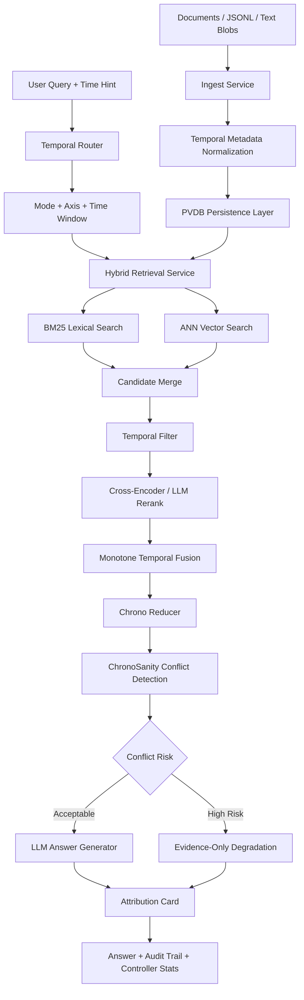

# ChronoRAG

Temporal retrieval-augmented generation for questions where **when** a source was valid is as important as **what** the source says.

ChronoRAG is a research-grade Python RAG scaffold for time-sensitive knowledge bases. It ingests documents with validity windows, transaction windows, provenance, authority signals, entities, regions, and units; retrieves evidence through hybrid lexical/vector search; applies temporal routing and monotone time-aware fusion; then generates an answer with attribution, conflict checks, and controller telemetry.

The project is not a generic chatbot. It is a temporal reasoning layer for RAG systems that need auditable answers over changing evidence.

## Problem Statement

Standard RAG systems usually rank passages by semantic similarity. That fails when a question depends on time.

Examples:

- “What was Europe’s GDP per capita in 1870?”
- “Which policy was valid during a specific period?”
- “Which source should be trusted when two claims overlap but belong to different revisions?”
- “Was the evidence valid at the requested time, or only published later?”

ChronoRAG addresses this by treating time as a first-class retrieval and generation constraint. Every answer is grounded in passages with explicit temporal metadata and provenance.

## Core Idea

ChronoRAG separates three concerns:

1. **Valid time** — when the claim is true in the real world.
2. **Transaction time** — when the system observed or stored the claim.
3. **Answer time** — the time window requested by the user.

The system retrieves and ranks evidence using these temporal dimensions instead of relying only on embedding similarity.

## Architecture



## Repository Layout

```text
chronorag/
├── app/                    # FastAPI app, routes, schemas, services, dependency wiring
│   ├── routes/             # API endpoints for ingest, retrieve, answer, policy, incidents
│   ├── schemas/            # Pydantic request/response contracts
│   └── services/           # Ingest, retrieve, answer, policy, maintenance logic
├── core/                   # Temporal reasoning, retrieval, routing, generation modules
│   ├── dhqc/               # Domain Heuristic Query Controller
│   ├── generator/          # Prompting, backend loading, answer generation
│   ├── gsm/                # Grounding/source/metadata heuristics
│   ├── retrieval/          # BM25, reranking, LLM judge hooks
│   └── router/             # Temporal query routing
├── storage/                # Cache, graph, and PVDB persistence layers
│   ├── cache/              # Redis-backed freshness/cache helpers
│   ├── graph/              # Graph-oriented storage experiments
│   └── pvdb/               # Persistent vector DB models and DAO
├── config/                 # Model, temporal policy, tenant, and axis configuration
├── cli/                    # Command-line ingestion/query workflows
├── data/                   # Sample and experimental data
├── tests/                  # Unit, fixture, and e2e test structure
├── notebooks/              # Research notebooks / Colab workflows
└── scripts/                # Developer automation
```

## What Works

- FastAPI application scaffold with health endpoint and routed services.
- CLI/API style flow for ingesting documents, retrieving evidence, and generating answers.
- Structured ingestion for Maddison/OECD-style world-economy JSONL plus unstructured text fallback.
- Temporal metadata handling through valid windows, transaction windows, entities, regions, units, provenance, authority, and facets.
- Hybrid retrieval using BM25 lexical search plus vector retrieval.
- Domain-aware retrieval fan-out for world-economy queries.
- Temporal filtering before final ranking.
- Cross-encoder reranking and optional LLM judge reranking.
- Monotone temporal fusion, so time compliance is part of the final ranking score.
- ChronoSanity-style conflict detection over overlapping evidence.
- Evidence-only fallback when conflicts or weak grounding make generation unsafe.
- Attribution cards with source windows, confidence, alternative windows, and counterfactual timelines.
- Controller telemetry: hop plan, executed hops, latency, token counts, degradation reason, retrieval weights, and router metrics.
- Config-driven model and policy selection through YAML files.
- Lightweight mode for tests/smoke runs and full mode for model-backed execution.

## What Does Not Work Yet

- This is not a deployed production service.
- No public hosted demo URL is currently documented.
- No benchmark table is included yet.
- Demo screenshots are committed under `assets/demo/`.
- No reproducible evaluation report is committed yet.
- No Dockerfile or production deployment manifest is visible in the repo root.
- Storage currently appears oriented around local persisted state and experimental PVDB abstractions, not a hardened multi-tenant Postgres/pgvector deployment.
- Authentication, authorization, rate limiting, and tenant isolation are not yet production-grade.
- Observability is designed conceptually through telemetry fields, but no complete OpenTelemetry dashboard/export pipeline is documented.
- The system should not be presented as a finished commercial RAG platform. Present it as a research scaffold and temporal-RAG prototype.

## Setup

### Option 1: Python virtual environment

```bash
git clone https://github.com/SSKG2602/chronorag.git
cd chronorag

python3.11 -m venv .venv
source .venv/bin/activate

pip install --upgrade pip
pip install -r requirements.txt
```

### Option 2: Conda

```bash
git clone https://github.com/SSKG2602/chronorag.git
cd chronorag

conda env create -f environment.yml
conda activate chronorag
```

## Environment Variables

```bash
export CHRONORAG_LIGHT=1        # 1 for lightweight smoke mode; 0 for full model execution
export HF_TOKEN=hf_xxx          # optional, for gated Hugging Face models
export LLM_ENDPOINT=...         # optional OpenAI-compatible endpoint
export LLM_API_KEY=...          # optional hosted LLM key
export REDIS_URL=...            # optional Redis cache/freshness backend
```

## Run Locally

```bash
# Start API
python -m app.uvicorn_runner

# Health check
curl http://localhost:8000/healthz
```

## CLI Demo

```bash
# Ingest sample documents
python -m cli.chronorag_cli ingest \
  data/sample/docs/aihistory1.txt \
  data/sample/docs/aihistory2.txt \
  data/sample/docs/aihistory3.txt

# Ask a temporal question
python -m cli.chronorag_cli answer \
  --query "Europe GDP per capita in 1870 (1990 intl$)" \
  --mode INTELLIGENT \
  --axis valid

# Clean local ingested artifacts
python -m cli.chronorag_cli purge
```

## Expected Demo Output Shape

A successful answer should return an object containing:

```json
{
  "answer": "...",
  "attribution_card": {
    "mode": "INTELLIGENT",
    "axis": "valid",
    "sources": [],
    "confidence": {}
  },
  "controller_stats": {
    "hops_used": 1,
    "hop_plan": {},
    "latency_ms": 0,
    "degraded": null,
    "retrieval_weights": {}
  },
  "audit_trail": [],
  "evidence_only": false,
  "reason": null
}
```

When grounding is weak or conflicts are detected, the system should degrade to an evidence-only response rather than force a confident answer.

## Screenshots / Demo Assets

Demo assets are stored in:

```text
assets/demo/
├── api-health.png
├── cli-ingest.png
├── cli-answer.png
├── attribution-card.png
└── controller-stats.png
```

Minimum screenshots to commit:

1. API health check.
2. CLI ingest command.
3. CLI temporal answer command.
4. Rendered answer JSON showing attribution card and controller stats.
5. One evidence-only degradation example.

## Temporal Retrieval Ablation

This small ablation isolates retrieval-stage behavior in light mode. The goal is
not to evaluate LLM writing quality, but to test whether each retrieval
configuration returns evidence with the expected valid-time window, source, unit,
and temporal text signal.

The result shows that ordinary keyword/vector retrieval can find relevant GDP
evidence, but fails the temporal-window constraint. Adding ChronoRAG's temporal
filter and temporal fusion raises Window Hit@5 from 0.00 to 1.00 on the sample
cases.

These numbers are from a deliberately small 3-query sanity benchmark, not a full
external benchmark. They validate component behavior rather than
state-of-the-art performance.

| Method | Window Hit@5 | Source Hit@5 | Unit Hit@5 | Text Hit@5 | Latency ms |
|---|---:|---:|---:|---:|---:|
| BM25 only | 0.00 | 1.00 | 1.00 | 1.00 | 163.7 |
| Vector only | 0.00 | 1.00 | 0.67 | 0.00 | 240.2 |
| Hybrid without temporal filter | 0.00 | 1.00 | 1.00 | 0.67 | 163.2 |
| Hybrid with temporal filter | 1.00 | 1.00 | 1.00 | 1.00 | 239.3 |
| Hybrid + temporal fusion | 1.00 | 1.00 | 1.00 | 1.00 | 164.8 |
| Hybrid + temporal fusion + rerank | 1.00 | 1.00 | 1.00 | 1.00 | 228.7 |

Reproduce:

```bash
CHRONORAG_LIGHT=1 python -m benchmarks.run_ablation \
  --cases benchmarks/temporal_qa_sample.jsonl \
  --top-k 5 \
  --candidate-k 150
```

## Technical Limitations

- Temporal extraction is partly heuristic and depends on document formatting.
- Domain support is strongest for the world-economy/Maddison-style path; other domains need dedicated policy sets and evaluation.
- Cross-encoder and LLM reranking can be expensive in full mode.
- Local model execution depends on CPU/GPU memory and Hugging Face model access.
- Current benchmark coverage is a small sanity check, not a broad temporal QA evaluation.
- Conflict detection is only as good as the extracted windows, passage granularity, and evidence coverage.
- Production use would require stronger persistence, migrations, background ingestion jobs, auth, monitoring, and deployment automation.

## Future Research Direction

1. **Temporal evaluation benchmark**
   - Build a small temporal QA set with known valid-time and transaction-time labels.
   - Compare vanilla RAG vs ChronoRAG on time-window correctness.

2. **Temporal retrieval ablations**
   - BM25 only vs ANN only vs hybrid.
   - Hybrid retrieval with and without temporal pre-mask.
   - Monotone temporal fusion vs ordinary rerank score.

3. **ChronoSanity reliability study**
   - Measure false positives and false negatives for conflict detection.
   - Evaluate when evidence-only degradation improves answer trust.

4. **Policy-set expansion**
   - Add domains beyond world economy: regulations, company filings, research papers, medical guidelines, and financial reports.

5. **Production storage path**
   - Move from local persisted state to Postgres + pgvector with migrations, tenant boundaries, and indexed temporal filters.

6. **Observability layer**
   - Export controller stats, degradation reasons, latency, token counts, and retrieval coverage to dashboards.

7. **Human-readable temporal audit cards**
   - Make the attribution card usable by analysts, not only developers.

## Positioning

ChronoRAG is best presented as:

> A temporal RAG research system that makes validity windows, source revision time, and evidence conflict handling explicit in retrieval and answer generation.

Do not position it as:

> A complete enterprise RAG platform.

## License

Apache-2.0.
