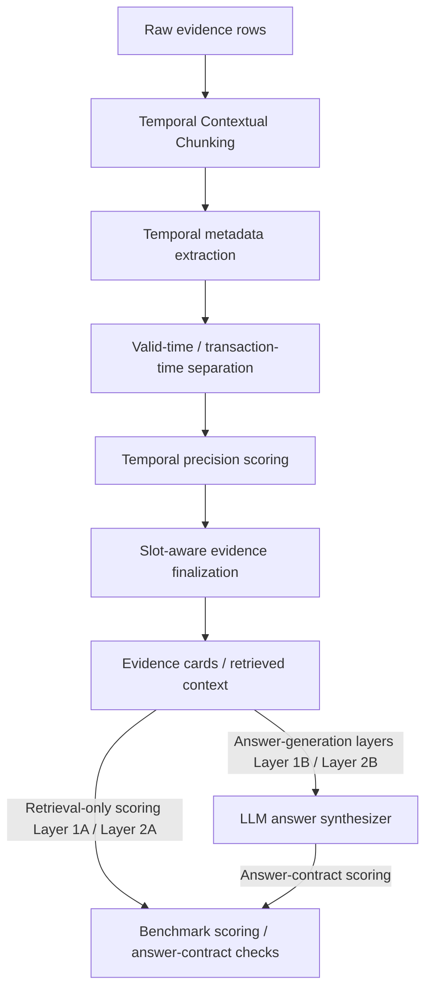

# ChronoRAG

ChronoRAG is a temporal retrieval and grounded answer-validation RAG framework.
It targets temporal failure modes in retrieval-augmented generation: evidence
that is topically relevant but valid at the wrong time, filings or publication
dates mistaken for fact time, broad background rows outranking exact evidence,
and generated answers that cite evidence while misusing its temporal role.

The system separates fact time from publication, filing, release, ingestion, or
other transaction time. It evaluates evidence selection and temporal grounding
under controlled benchmark conditions. ChronoRAG reports controlled benchmark
evidence for temporal retrieval behavior under explicitly scoped datasets and
validators. The claims are limited to the tested settings: temporal retrieval,
evidence selection, answer-contract validation, and component ablation behavior.
The project does not generalize these results beyond the benchmark conditions
without additional evaluation.

## Why Temporal RAG Is Hard

Standard RAG often ranks passages by lexical or semantic relevance. Temporal
questions need more than topical match:

- A row can mention the right entity but the wrong date.
- A filing, publication, or release date can be confused with the time a claim
  was true.
- Broad historical context can outrank exact dated evidence.
- A query can explicitly exclude a nearby date.
- A comparison question can need evidence from multiple time slots.
- A generated answer can cite plausible evidence while violating the requested
  valid-time contract.

ChronoRAG makes these cases explicit in retrieval, evidence finalization, and
answer validation.

## What ChronoRAG Actually Adds

### Temporal Contextual Chunking

Temporal Contextual Chunking keeps the original evidence row available for
grounding while building retrieval text that states the entity, metric, source,
document context, and temporal role more explicitly. It exists because raw rows
often carry too little context for retrieval: a date, value, or filing mention
can look relevant without showing whether it is the time of the claim or merely
document metadata. The targeted failure mode is topically close evidence that
wins ranking because its surrounding temporal context was implicit or missing.

### `valid_time` vs `transaction_time` separation

ChronoRAG separates when a claim is true from when that claim was filed,
published, released, observed, imported, or ingested. This distinction exists
because RAG systems often over-trust prominent dates in a passage even when
those dates describe document lifecycle events rather than the fact being
asked about. The targeted failure mode is treating a publication date, SEC
filing date, release date, or ingestion date as the valid time of the economic,
market, legal, or software claim.

### Temporal precision scoring

Temporal precision scoring compares the query's requested time against the
candidate evidence at the right granularity: year, month, day, timestamp,
quarter, daypart, range, or fuzzy range. It exists because a broad match to the
right year or range is not equivalent to exact dated support when the question
asks for a precise time. The targeted failure mode is letting broad-window or
nearby-date evidence outrank exact evidence for the requested temporal slot.

### Negative/polarity-aware temporal constraints

Some questions specify dates that should be excluded, such as a market movement
that must not be explained with evidence from a nearby date. ChronoRAG treats
target dates and forbidden dates as different retrieval signals instead of
collapsing them into one bag of temporal tokens. The targeted failure mode is
retrieving evidence that is lexically relevant because it mentions the excluded
date, even though the question explicitly rules it out.

### Source/metric-aware ranking adjustment

ChronoRAG uses source family, source file, metric, claim, unit, and version
anchors when the question asks for a specific source or measurement. This
exists because temporal retrieval errors are often source or metric errors in
disguise: a GDP row can be confused with GDP per capita, or a release note can
be confused with a market index series if time alone is scored. The targeted
failure mode is selecting temporally plausible evidence with the wrong source
family, wrong file, wrong metric, or wrong version role.

### Slot-aware final evidence assembly

Comparison, before/after, and multi-entity questions need coverage across
multiple evidence slots rather than only the highest-scoring rows overall.
Slot-aware assembly exists because one dominant entity, year, or source family
can fill the final top-k and crowd out the other side of the comparison. The
targeted failure mode is a superficially strong retrieval set that cannot
support the actual multi-slot question.

### Answer-contract validation

Answer-contract validation checks whether a generated or deterministic answer
cites expected evidence, uses valid time correctly, avoids transaction-time
misuse, handles insufficient evidence, and satisfies provider-output contracts.
It exists because a model can cite plausible evidence while still making the
wrong temporal claim. The targeted failure mode is answer generation that looks
grounded but violates the requested temporal role, citation contract, or
partial/refusal behavior.

### Controlled benchmark correction process

ChronoRAG keeps benchmark correction as part of the research process rather
than treating every early benchmark category as final. Layer 2A revisions
documented where question wording, expected evidence, forbidden evidence, or
corpus availability made an earlier test invalid or under-specified. The
targeted failure mode is evaluating retrieval behavior against hidden
assumptions instead of aligned question text and available evidence.

## Architecture



The architecture has two evaluation paths. In the retrieval-only path, evidence
cards and retrieved context are scored directly in Layer 1A and Layer 2A, so the
benchmark evaluates selected evidence IDs rather than generated prose. In the
answer-synthesis path, retrieved evidence is passed to the LLM answer
synthesizer; then answer-contract checks evaluate citations, valid-time use,
transaction-time misuse, partial/refusal behavior, and provider-output shape in
Layer 1B and planned Layer 2B.

Core pieces:

| Component | Role |
|---|---|
| Temporal Contextual Chunking | Preserves raw evidence for grounding while adding structured retrieval text with temporal, entity, unit, source, and document context. |
| `valid_time` / `transaction_time` separation | Keeps when a claim is true separate from when it was filed, published, released, observed, or ingested. |
| Temporal precision scoring | Scores year, month, day, timestamp, range, fuzzy range, quarter, and daypart matches before answer synthesis. |
| Polarity and negative constraints | Treats target dates differently from excluded dates such as `not 1990-03-28`. |
| Source / metric normalization | Rewards source-family, source-file, metric, claim, and version anchors when the question asks for them. |
| Slot-aware finalization | Assembles evidence for comparison and multi-slot questions so one side does not dominate top-k. |
| Benchmark scoring / answer-contract checks | Scores retrieval-only evidence cards directly for Layer 1A and Layer 2A, and checks cited evidence, valid-time use, transaction-time misuse, partial/refusal behavior, and provider-output contracts after synthesis in Layer 1B and planned Layer 2B. |

Retrieval-only layers score evidence cards directly. LLM answer synthesis is
used only for answer-generation layers, with answer-contract checks applied
after synthesis. Retrieval scoring and deterministic checks can be run without
Vertex.

## Evaluation Map

| Layer | Scope | What It Tests | Boundary |
|---|---|---|---|
| Layer 1A | Temporal retrieval benchmark | Whether retrieval finds temporally correct evidence and avoids temporal distractors. | Retrieval-focused only. |
| Layer 1B | Temporal answer validation | Whether generated or light-mode answers satisfy a grounded temporal answer contract. | Answer-contract validation over controlled cases. |
| Layer 2A | Cross-domain retrieval-only benchmark | Whether retrieval behavior holds across a selected cross-domain corpus and v3 aligned questions. | Selected evidence IDs only; no natural-language answer scoring. |
| Layer 2B | Natural-language temporal QA | 50 manually designed questions using ChronoRAG + Vertex + dynamic top-k + answer validation. | Answer synthesis and validation with expected evidence available where needed; retrieval quality remains Layer 2A. |

## Layer 1A: Temporal Eval v2

Layer 1A is a controlled temporal retrieval benchmark. It asks whether the
retriever can select the right evidence when time is part of the query, not just
whether it can find a semantically related passage.

It tests exact valid-time retrieval, wrong-year and wrong-time traps, broad
window distractors, valid-time versus transaction-time behavior, proxy conflict
cases, and partial/refusal proxy behavior. In simple terms, the benchmark checks
whether the system finds evidence that is true at the requested time and avoids
nearby evidence that merely looks relevant.

Benchmark files:

- `benchmarks/run_temporal_eval_v2.py`
- `benchmarks/temporal_eval_v2_15.jsonl`
- `data/sample/temporal_eval_v2/`
- `benchmarks/results/temporal_eval_v2_results.md`
- `benchmarks/results/temporal_eval_v2_results.json`

Stored light-mode result:

| Method | Hit@5 Evidence | Top1 Window | Hit@5 Window | Source Family Hit@5 | Distractor Avoidance | Proxy Behavior Correct |
|---|---:|---:|---:|---:|---:|---:|
| Hybrid + temporal fusion + rerank | 0.80 | 0.80 | 0.93 | 0.87 | 0.93 | 0.80 |

These are controlled benchmark results for the 15-case Temporal Eval v2 setting.

## Layer 1B: Temporal Answer Validation

Layer 1B evaluates answer contract behavior, not only retrieval. It checks
whether an answer cites expected evidence, uses valid time correctly, avoids
treating transaction time as fact time, follows partial/refusal behavior when
the evidence is insufficient, and returns the required provider-output shape.

Execution paths:

- Dry-run prompts: prompt construction only; no provider call.
- Light mode: deterministic, CI-safe answer harness.
- Vertex mode: provider-backed answer synthesis with strict schema, grounding,
  and temporal-rule validation.

Benchmark files:

- `benchmarks/run_temporal_answer_validation_v2.py`
- `benchmarks/temporal_answer_validation_v2_15.jsonl`
- `benchmarks/results/temporal_answer_validation_v2_*.md`
- `benchmarks/results/temporal_answer_validation_v2_*.json`

The primary stored Vertex top-k 5 result is
`benchmarks/results/temporal_answer_validation_v2_vertex_topk5_results.md`.
It reports `0.80` answer overall pass, `1.00` expected evidence citation,
`1.00` valid-time correctness, `1.00` transaction-time trap avoidance, `1.00`
provider contract pass, and `1.00` grounding validation pass in this tested
setting. Non-passing cases remain part of the documented answer-behavior
boundary.

## Layer 2A: Cross-Domain Retrieval-Only

Layer 2A is a controlled cross-domain retrieval-only benchmark. It validates
selected evidence behavior, not generated natural-language answers.

### Layer 2A dataset and method setup

Dataset and corpus context:

- The raw pool had about 46,503 detected rows or items across FRED macro,
  market/index, SEC submissions, Federal Register, and GitHub release source
  families.
- The Layer 2A benchmark uses a selected 5,000-row cross-domain corpus for
  controlled evaluation.
- The final Layer 2A benchmark uses 200 v3 aligned questions.
- The 5,000-row corpus used during benchmark execution is generated/working
  data and may not be fully tracked in Git because generated corpus artifacts
  are excluded from normal public commits.
- The public repository contains question definitions, builders, validators,
  sample corpus files, final result artifacts, and reproducibility commands.

Source families:

- FRED macro
- Market/index series
- SEC submissions
- Federal Register
- GitHub releases

Tracked and generated data are intentionally distinguished:

- Tracked sample corpus:
  `benchmarks/layer2_crossdomain/data/layer2_corpus.sample.jsonl`
- Generated/working full corpus:
  `benchmarks/layer2_crossdomain/data/layer2_corpus.jsonl`
- Final question file:
  `benchmarks/layer2_crossdomain/data/layer2_questions.jsonl`
- Raw-pool scale manifest:
  `benchmarks/layer2_crossdomain/data/raw_pool_manifest.json`

Methods compared:

- `chronorag_full`
- `metadata_temporal_rag`

Scoring boundary:

- Layer 2A scores `selected_evidence_ids` only.
- It does not score generated natural-language answers.
- Diagnostic categories are separated where applicable so source, temporal,
  slot, forbidden-evidence, and insufficiency behavior can be interpreted
  without blending them into one opaque aggregate.

### Data used in Layer 2A

Layer 2A starts from a raw pool of about 46,503 detected rows or items. The
controlled benchmark uses a selected 5,000-row corpus and 200 v3 aligned
questions built against that selected corpus.

The source families represented in the Layer 2A setup are FRED macro,
market/index series, SEC submissions, Federal Register, and GitHub releases.
Those families are used to test whether temporal retrieval behavior survives
across macroeconomic, market, filing, regulatory, and software-release
contexts.

The 5,000-row full corpus is generated working data. A full working corpus may
exist at `benchmarks/layer2_crossdomain/data/layer2_corpus.jsonl` during local
or GCP benchmark execution. The public repository keeps sample corpus files
and final result artifacts so the benchmark boundary is visible without
committing every generated data row.

New Layer 2B questions must be built from the selected 5,000-row corpus, not
the 46,503-row raw pool, unless the corpus is intentionally rebuilt and the
question/evidence contracts are regenerated against that new corpus.

### Layer 2A public source/provenance links

The Layer 2A raw pool was assembled from public cross-domain source families
before selecting the 5,000-row controlled evaluation corpus. These links
identify the public source families used for verification and rebuilding; they
are not a claim that the generated 5,000-row corpus is directly committed in
full.

| Source family | Used for | Public source/provenance link |
|---|---|---|
| FRED macro series | Federal funds rate and 10-year Treasury yield series such as `FEDFUNDS` and `DGS10`. | `https://fred.stlouisfed.org/docs/api/fred/v2/index.html`; `https://fred.stlouisfed.org/series/FEDFUNDS`; `https://fred.stlouisfed.org/series/DGS10` |
| FRED market/index series | Market/index series used in the cross-domain pool, including `SP500`, `DJIA`, and `NASDAQCOM`. | `https://fred.stlouisfed.org/series/SP500`; `https://fred.stlouisfed.org/series/DJIA`; `https://fred.stlouisfed.org/series/NASDAQCOM` |
| SEC EDGAR submissions | Company filing/submission metadata and filing-time examples. | `https://www.sec.gov/search-filings/edgar-application-programming-interfaces` |
| Federal Register | Federal agency rule/document records and publication-time examples. | `https://www.federalregister.gov/developers/documentation/api/v1` |
| GitHub releases | Repository release records and software-version temporal examples. | `https://docs.github.com/rest/releases/releases` |

The reported Layer 2A metrics were produced on the selected 5,000-row
evaluation corpus derived from these raw/source families. The README separates
raw source provenance, generated corpus artifacts, tracked samples, question
files, validators, and final result artifacts so the benchmark boundary is
auditable.

Final public result files:

- `benchmarks/layer2_crossdomain/results/layer2_retrieval_only_v3_200_eval.md`
- `benchmarks/layer2_crossdomain/results/layer2_retrieval_only_v3_200_eval.json`
- `benchmarks/layer2_crossdomain/results/layer2_ablation_v3_ablation200.md`
- `benchmarks/layer2_crossdomain/results/layer2_ablation_v3_ablation200.json`
- `benchmarks/layer2_crossdomain/results/conflict_data_contract_blocked_v3.md`
- `benchmarks/layer2_crossdomain/results/conflict_data_contract_blocked_v3.json`

Layer 2A v3 retrieval-only summary:

| Method | Cases | Generic Hit@1 | Generic Hit@5 | Forbidden absent@5 | Category primary pass |
|---|---:|---:|---:|---:|---:|
| `chronorag_full` | 200 | 0.82 | 0.90 | 0.99 | 0.96 |
| `metadata_temporal_rag` | 200 | 0.69 | 0.86 | 0.69 | 0.48 |

These metrics score `selected_evidence_ids`. They do not evaluate generated
answer wording, fluency, or natural-language reasoning.

### What the Layer 2A result means

In the controlled v3 benchmark, `chronorag_full` had higher category-primary
pass than `metadata_temporal_rag`. The difference is not only generic Hit@5:
the larger practical gap is cleaner final evidence selection under
category-specific temporal constraints, including cases where forbidden evidence
must stay out of the final top-k.

`metadata_temporal_rag` still retrieves many relevant rows, especially under
generic Hit@5. The benchmark shows that relevant retrieval alone is not always
enough when the final evidence set must satisfy temporal role, source/metric,
slot coverage, and forbidden-evidence constraints. Weaker finalization or
constraint handling can allow wrong-role or forbidden evidence to remain in the
selected evidence set.

These results support the tested claim that explicit temporal roles and final
evidence gating improve controlled temporal retrieval behavior on this Layer 2A
benchmark. They do not evaluate natural-language answer quality, provider
behavior, or untested production workloads.

### Layer 2B Full-50 Answer Validation

Layer 2B full-50 artifacts:

- `benchmarks/layer2_crossdomain/results/layer2b_chronorag_full_layer2b_full50_vertex_final_results.md`
- `benchmarks/layer2_crossdomain/results/layer2b_judge_layer2b_full50_judge_final_results.md`
- `benchmarks/layer2_crossdomain/results/layer2b_full50_manual_audit.md`

| Layer 2B metric | Score |
|---|---:|
| Deterministic hard-contract pass | 38 / 50 = 76% |
| LLM judge semantic pass | 38 / 50 = 76% |
| Strict combined pass | 35 / 50 = 70% |
| Manual-audited acceptable pass | 41 / 50 = 82% |

The strict combined pass is the conservative score. The manual-audited
acceptable pass accepts 3 cases where hard validation failed but judge and
manual review agreed the answer was semantically correct. Expected-evidence
injection was used, so Layer 2B measures answer synthesis and validation, not
retrieval quality. Retrieval quality is reported separately in Layer 2A.

## Layer 2A Ablation Summary

The ablation runner removes one component at a time where possible and scores
the same 200 v3 questions.

| Variant | What Is Removed or Changed | Why It Matters |
|---|---|---|
| `chronorag_full` | Full Layer 2A ChronoRAG path. | Reference setting for component ablations. |
| `chronorag_no_tcc` | Uses raw row text instead of Temporal Contextual Chunking retrieval text. | Tests whether enriched temporal/entity/source context helps retrieval. |
| `chronorag_no_temporal_precision` | Disables explicit temporal precision scoring and negative exact-time suppression. | Tests exact-date ranking and wrong-time trap handling. |
| `chronorag_no_transaction_role` | Disables final cleanup that demotes transaction-time-only evidence when valid time is requested. | Tests separation of fact time from filing/publication/release time. |
| `chronorag_no_source_metric` | Disables source and metric adjustment in finalization. | Tests source-family, source-file, metric, claim, and version constraints. |
| `chronorag_no_slot_assembler` | Disables slot-aware evidence assembly. | Tests multi-slot and cross-domain comparison coverage. |
| `chronorag_score_only` | Uses fused ranking without finalization components. | Tests whether retrieval finalization adds behavior beyond score ordering. |
| `metadata_temporal_rag` | Metadata-oriented temporal retrieval baseline. | Provides a comparison point for selected-evidence behavior. |

### Stored ablation scores

These scores are copied from
`benchmarks/layer2_crossdomain/results/layer2_ablation_v3_ablation200.md`.

| Variant | Cases | Generic Hit@1 | Generic Hit@5 | Forbidden absent@5 | Category primary pass | Delta vs chronorag_full | Interpretation |
|---|---:|---:|---:|---:|---:|---:|---|
| `chronorag_full` | 200 | 0.8250 | 0.8950 | 0.9950 | 0.9625 | 0.0000 | Reference setting for this ablation run. |
| `chronorag_no_tcc` | 200 | 0.8350 | 0.8950 | 0.9950 | 0.9625 | 0.0000 | Same overall category-primary pass as full in this controlled run. |
| `chronorag_no_temporal_precision` | 200 | 0.7500 | 0.8500 | 0.9450 | 0.7500 | -0.2125 | Lower category-primary pass when precision handling is disabled. |
| `chronorag_no_transaction_role` | 200 | 0.8250 | 0.8950 | 0.9950 | 0.9625 | 0.0000 | Same overall category-primary pass as full in this controlled run. |
| `chronorag_no_source_metric` | 200 | 0.8300 | 0.8900 | 1.0000 | 0.9688 | 0.0062 | Source/metric ablation did not reduce overall primary pass in this run. |
| `chronorag_no_slot_assembler` | 200 | 0.8300 | 0.8900 | 0.8150 | 0.7750 | -0.1875 | Lower forbidden-absence and category-primary pass without slot assembly. |
| `chronorag_score_only` | 200 | 0.8150 | 0.9850 | 0.6500 | 0.5625 | -0.4000 | High generic Hit@5 but weaker final selected-evidence behavior. |
| `metadata_temporal_rag` | 200 | 0.6900 | 0.8600 | 0.6950 | 0.4813 | -0.4813 | Independent metadata baseline with lower category-primary pass here. |

The ablation score table is the fastest way to see which component removals
changed behavior in the controlled 200-question Layer 2A v3 benchmark. The
per-ablation descriptions below explain why those score differences matter:
they connect metric changes to the expected failure modes for retrieval text,
temporal precision, transaction roles, source/metric anchors, slot coverage,
and final eligibility-gated selection.

### `chronorag_no_tcc`

What was removed: this variant uses raw row text instead of Temporal
Contextual Chunking retrieval text. It removes the enriched retrieval framing
that names temporal metadata, source context, entity context, and document
context around the evidence row.

Expected failure mode: raw rows can be underspecified, especially when values,
dates, release labels, or filings need surrounding context to be interpreted
correctly. Without TCC, retrieval can over-rank rows that share surface tokens
but do not clearly support the requested temporal claim.

What it helps interpret: this ablation isolates the value of contextual
retrieval text and structured row framing before later scoring and finalization
steps operate on candidate evidence.

### `chronorag_no_temporal_precision`

What was removed: this variant disables explicit temporal precision scoring,
including exact day, month, year, timestamp, range, and nearby-time handling
used before final evidence assembly.

Expected failure mode: evidence from a nearby date, broad range, or weaker
temporal granularity can outrank exact evidence for the requested time. It also
weakens suppression of wrong-time evidence when the question depends on exact
temporal alignment.

What it helps interpret: this ablation shows how much of the controlled
retrieval behavior comes from explicit temporal precision rather than ordinary
semantic or metadata relevance.

### `chronorag_no_transaction_role`

What was removed: this variant disables the final cleanup that demotes
transaction-time-only evidence when the question asks for valid-time evidence.
It reduces the system's ability to distinguish claim time from filing,
publication, release, observation, import, or ingestion time at final selection.

Expected failure mode: document lifecycle dates can remain in the final top-k
as if they supported the requested fact time. This is especially important for
SEC, Federal Register, release, and imported-data cases where transaction dates
are prominent.

What it helps interpret: this ablation tests whether valid-time and
transaction-time separation is only descriptive metadata or whether it changes
the selected evidence behavior in the benchmark.

### `chronorag_no_source_metric`

What was removed: this variant disables source and metric adjustment in
finalization, including source-family, source-file, metric, claim, unit, and
version anchors where those constraints are available.

Expected failure mode: the retriever can select evidence that is temporally
plausible but tied to the wrong source family, file, metric, or version role.
For example, a row may match the date but support a different measurement or
come from the wrong source lineage.

What it helps interpret: this ablation separates temporal matching from the
source and measurement constraints needed for evidence contracts that ask for a
specific series, filing family, release family, metric, or version.

### `chronorag_no_slot_assembler`

What was removed: this variant disables slot-aware evidence assembly for
multi-slot questions. It relies more heavily on global ranking rather than
ensuring coverage across requested entities, dates, sources, or comparison
sides.

Expected failure mode: one dominant slot can fill the final top-k while another
required slot is absent. A comparison question can therefore retrieve many
relevant rows but still fail to provide the evidence coverage needed to answer
the actual question.

What it helps interpret: this ablation tests whether final evidence assembly is
needed for multi-slot temporal retrieval, beyond simply scoring each candidate
row independently.

### `chronorag_score_only`

What was removed: this variant uses fused score ordering without the final
eligibility-gated selection behavior provided by the full finalization path.
It keeps scoring but removes the stronger selection layer that applies
constraints before final top-k evidence is accepted.

Expected failure mode: high-scoring rows that are topically or temporally close
can remain in the final set even when they violate a forbidden-evidence,
wrong-role, source/metric, slot-coverage, or insufficiency constraint.

What it helps interpret: this ablation tests whether fused ranking alone is
enough, or whether controlled temporal retrieval needs a final evidence gate
that enforces eligibility after scores are computed.

### `metadata_temporal_rag`

What was changed: this is an independent temporal metadata retrieval baseline,
not a deliberately weakened copy of ChronoRAG. It uses temporal metadata to
retrieve and rank evidence, but it does not include the full ChronoRAG
combination of TCC, precision handling, temporal-role cleanup, source/metric
adjustment, slot-aware assembly, and final eligibility gating.

Expected failure mode: the baseline can retrieve many relevant rows while still
allowing wrong-role, forbidden, missing-slot, or source/metric-mismatched
evidence into the final selected set.

What it helps interpret: this comparison separates generic metadata-aware
temporal retrieval from the fuller controlled-evidence pipeline. It provides a
useful reference point for understanding which behaviors require ChronoRAG's
additional finalization and contract-aware retrieval steps.

Stored result:

- `benchmarks/layer2_crossdomain/results/layer2_ablation_v3_ablation200.md`

Read `benchmarks/layer2_crossdomain/results/layer2_ablation_v3_ablation200.md`
for the stored metrics and case-level interpretation. The report should be read
as component ablation evidence in this controlled benchmark, not as a claim
about untested domains or workloads.

## Failure documentation and benchmark correction history

The current public Layer 2A v3 benchmark includes corrections made for
benchmark validity. Initial Layer 2A categories exposed both real design issues
and benchmark-design issues: some failures pointed to retrieval and
finalization behavior that needed to be tested, while others showed that the
benchmark itself was asking for evidence the question text did not fairly
specify.

Broad-window and year-only questions were invalid when the expected evidence
required a hidden exact date. A question can ask for a broad year, range, or
period, but it should not silently require a specific day or month unless that
precision is visible in the wording or category contract. The v3 rebuild
reframed those cases so question wording, expected evidence, and forbidden
evidence were aligned.

Conflict detection was blocked because the corpus did not contain reliable real
conflict-pair rows for the intended category. Rather than report a conflict
metric over synthetic or unavailable evidence, the benchmark preserves the
blocked data-contract note at
`benchmarks/layer2_crossdomain/results/conflict_data_contract_blocked_v3.md`.

Some early Vertex and judge artifacts were archived because they mixed
answer-generation or provider behavior with the retrieval-only Layer 2A
boundary. Layer 2A now reports selected-evidence retrieval behavior; provider
backed natural-language answer behavior belongs to Layer 1B and planned Layer
2B. This separation keeps the benchmark boundary clear.

The v3 rebuild aligned question wording, expected evidence, forbidden evidence,
diagnostic categories, and corpus availability. This is part of the research
process: failed or invalid benchmark assumptions were documented and corrected
rather than hidden, and the final public Layer 2A files distinguish controlled
retrieval results from development history.

## Current public branch status

Current branch: `audit/core-path-scope`.

This branch includes Layer 1A, Layer 1B, and Layer 2A:

- Layer 1A: controlled temporal retrieval benchmark.
- Layer 1B: temporal answer-contract validation with dry-run, light-mode, and
  Vertex execution paths.
- Layer 2A: cross-domain retrieval-only benchmark over the selected v3 corpus
  and aligned question set.

Older `main` and `feature/vertex-provider-mode` branch points refer to the
Layer 1B checkpoint at commit `b98002a`. Planned repository cleanup includes
creating or preserving a Layer 1 archive branch, then promoting this branch to
`main` after Layer 2B planning and final public cleanup are complete.

## Current Limitations And Next Work

### Current limitations

Layer 2A is retrieval-only. It evaluates whether the benchmark methods select
the expected evidence IDs and avoid forbidden evidence under controlled
category contracts, but it does not score final natural-language answer quality,
fluency, or reasoning.

The generated 5,000-row Layer 2A corpus may not be fully tracked in Git because
generated corpus artifacts are excluded from normal public commits. The
repository keeps the question definitions, sample corpus files, validators,
result artifacts, and reproducibility commands visible, while distinguishing
tracked samples from generated working data.

Conflict detection requires real conflict-pair data. The current corpus did not
provide reliable real conflict-pair rows for the planned Layer 2A conflict
category, so that category is documented as data-contract blocked rather than
reported as a normal retrieval metric.

Some raw-data-dependent Layer 1 builder tests require external raw files. The
tracked sample and light-mode commands are intended for deterministic local
checks, while raw builder paths depend on data that may not be present in a
fresh checkout.

Results are scoped to the benchmark conditions described here and in the result
files. ChronoRAG is not a deployed production service; storage,
authentication, observability, and multi-tenant deployment paths are not
production-hardened.

### Layer 2B planned work

Layer 2B is planned as a natural-language temporal QA layer with 50 manually
designed questions. The questions should be built evidence-card-first from the
selected 5,000-row corpus so each prompt has a clear expected evidence contract
before provider-backed answer synthesis is run.

The planned execution path is ChronoRAG + Vertex + dynamic top-k, followed by
answer-contract validation. Metadata+LLM comparison is not the current goal for
Layer 2B; the goal is to test ChronoRAG answer synthesis and validation after
retrieval.

Layer 2B question design should test relative temporal reasoning, including
month-before and month-after questions, closest release to filing date, macro
event before market movement, valid-time versus filing-time traps, and
insufficient or ambiguous temporal evidence.
Layer 2B question design must use the selected 5,000-row evaluation corpus as
the evidence universe unless the corpus is intentionally rebuilt from the
raw/source families above.

### Research/report work

Planned research and communication work includes a technical report,
arXiv-style draft, LinkedIn/build-log posts, and a professor or lab outreach
summary. These are planned reporting artifacts, not completed benchmark layers.

### Layer 2B natural-language QA plan

Layer 2B remains planned work. The intended benchmark is 50 manually designed
natural-language temporal QA questions built from evidence cards in the
selected 5,000-row Layer 2A corpus. The planned path is retrieval with
ChronoRAG, Vertex-backed answer synthesis, dynamic top-k selection, and
answer-contract validation.

### Technical report / arXiv-style draft

The technical report and arXiv-style draft remain planned reporting work. The
report should use the current Layer 1A, Layer 1B, and Layer 2A results, then
incorporate Layer 2B results once that planned answer-generation benchmark is
available.

### Outreach and portfolio work

README and technical-report material are intended to support professor or lab
outreach, LinkedIn build-log posts, and research portfolio presentation. This
work should summarize the controlled benchmark setup, correction history, and
result boundaries without presenting planned Layer 2B work as completed.

## Reproduce

The commands below are grouped by reproducibility boundary. Some commands run
deterministically from tracked benchmark definitions and samples, while the
full Layer 2A comparison requires the generated 5,000-row corpus at
`benchmarks/layer2_crossdomain/data/layer2_corpus.jsonl`.

Set light mode for deterministic local runs:

```bash
export CHRONORAG_LIGHT=1
```

### Deterministic and tracked-sample commands

The Layer 1A and Layer 1B commands below are intended for deterministic local
checks. Layer 1A builds and evaluates the tracked temporal sample benchmark.
Layer 1B dry-run mode constructs prompts without a provider call, and Layer 1B
light mode uses the deterministic answer harness.

Layer 1A retrieval benchmark:

```bash
python3 benchmarks/build_temporal_eval_v2.py
python3 benchmarks/run_temporal_eval_v2.py --light
```

Layer 1B dry-run prompts:

```bash
python3 benchmarks/run_temporal_answer_validation_v2.py \
  --mode vertex \
  --dry-run-prompts \
  --top-k 5 \
  --result-suffix dry_run_prompts
```

Layer 1B light mode:

```bash
python3 benchmarks/run_temporal_answer_validation_v2.py \
  --mode light \
  --top-k 5
```

### Commands requiring the generated full Layer 2A corpus

The following commands require the generated full corpus file at
`benchmarks/layer2_crossdomain/data/layer2_corpus.jsonl`. The tracked sample
corpus documents the schema and provides small public examples, but the stored
Layer 2A v3 200-case comparison was produced against the selected 5,000-row
working corpus.

Layer 2A dataset validation:

```bash
python3 benchmarks/layer2_crossdomain/validate_layer2_dataset.py \
  --corpus benchmarks/layer2_crossdomain/data/layer2_corpus.jsonl \
  --questions benchmarks/layer2_crossdomain/data/layer2_questions.jsonl
```

Layer 2A retrieval comparison:

```bash
python3 benchmarks/layer2_crossdomain/run_layer2_comparison.py \
  --method all \
  --mode dry_run \
  --dataset real \
  --limit 200 \
  --top-k 5 \
  --result-suffix v3_200

python3 benchmarks/layer2_crossdomain/evaluate_retrieval_only.py \
  --results benchmarks/layer2_crossdomain/results/layer2_chronorag_full_v3_200_results.json \
            benchmarks/layer2_crossdomain/results/layer2_metadata_temporal_rag_v3_200_results.json \
  --questions benchmarks/layer2_crossdomain/data/layer2_questions.jsonl \
  --save-json benchmarks/layer2_crossdomain/results/layer2_retrieval_only_v3_200_eval.json \
  --save-md benchmarks/layer2_crossdomain/results/layer2_retrieval_only_v3_200_eval.md
```

Layer 2A ablation:

```bash
python3 benchmarks/layer2_crossdomain/run_layer2_ablations.py \
  --corpus benchmarks/layer2_crossdomain/data/layer2_corpus.jsonl \
  --questions benchmarks/layer2_crossdomain/data/layer2_questions.jsonl \
  --mode dry_run \
  --limit 200 \
  --top-k 5 \
  --result-suffix v3_ablation200
```

### Raw external file boundary

Some raw-data-dependent Layer 1 builder tests require external raw files that
may not be present in a fresh checkout. Those paths are separate from the
tracked sample and light-mode commands above.

### Layer 2A provider boundary

Do not run Vertex for Layer 2A retrieval-only reporting. Provider-backed
natural-language temporal QA belongs to future Layer 2B work.

## Reading guide

Start with this README for the project overview, benchmark layers, current
scope, and reproduction boundaries. Read `docs/TECHNICAL_REPORT.md` for
technical details, design rationale, and broader discussion of the temporal RAG
pipeline.

For Layer 2A specifically, read `benchmarks/layer2_crossdomain/README.md` for
the cross-domain benchmark setup and implementation notes. Read the result
Markdown files under `benchmarks/results/` and
`benchmarks/layer2_crossdomain/results/` for actual benchmark outputs. Archived
result files should be treated as development history, especially when they
come from intermediate provider or judge experiments rather than the final
retrieval-only Layer 2A boundary.

## Data and Artifact Structure

### Tracked source and application code

- `app/`: FastAPI application routes, schemas, and service wiring.
- `core/`: temporal retrieval, contextual chunking, routing, ranking, and
  generation support code.
- `storage/`: local persistence abstractions for PVDB/cache-style storage.
- `tests/`: unit tests and benchmark contract tests.

### Layer 1 benchmark artifacts

- `benchmarks/run_temporal_eval_v2.py`: Layer 1A retrieval benchmark runner.
- `benchmarks/run_temporal_answer_validation_v2.py`: Layer 1B answer-contract
  validation runner.
- `benchmarks/temporal_eval_v2_15.jsonl`: Layer 1A controlled temporal
  retrieval cases.
- `benchmarks/temporal_answer_validation_v2_15.jsonl`: Layer 1B answer
  validation cases.
- `benchmarks/results/temporal_eval_v2_results.md`: stored Layer 1A result
  report.
- `benchmarks/results/temporal_answer_validation_v2_*.md`: stored Layer 1B
  result reports across dry-run, light, and provider-backed settings.
- `data/sample/temporal_eval_v2/`: tracked sample data used by the Layer 1A
  temporal benchmark path.

### Layer 2A benchmark artifacts

- `benchmarks/layer2_crossdomain/build_layer2_corpus.py`: builder for the
  selected cross-domain corpus.
- `benchmarks/layer2_crossdomain/generate_layer2_questions_v3.py`: v3 aligned
  question generator.
- `benchmarks/layer2_crossdomain/validate_layer2_dataset.py`: dataset and
  question-contract validation.
- `benchmarks/layer2_crossdomain/run_layer2_comparison.py`: retrieval-only
  method comparison runner.
- `benchmarks/layer2_crossdomain/evaluate_retrieval_only.py`: selected
  evidence evaluation script.
- `benchmarks/layer2_crossdomain/run_layer2_ablations.py`: Layer 2A ablation
  runner.
- `benchmarks/layer2_crossdomain/data/layer2_questions.jsonl`: final v3 aligned
  Layer 2A questions.
- `benchmarks/layer2_crossdomain/data/layer2_corpus.sample.jsonl`: tracked
  sample corpus rows documenting schema and examples.
- `benchmarks/layer2_crossdomain/data/raw_pool_manifest.json`: raw-pool scale
  manifest for the detected 46,503-row/item pool.

### Final public Layer 2A results

- `benchmarks/layer2_crossdomain/results/layer2_retrieval_only_v3_200_eval.md`:
  final v3 retrieval-only comparison report.
- `benchmarks/layer2_crossdomain/results/layer2_ablation_v3_ablation200.md`:
  final v3 ablation report.
- `benchmarks/layer2_crossdomain/results/conflict_data_contract_blocked_v3.md`:
  blocked conflict-category data-contract note.
- `benchmarks/layer2_crossdomain/results/README.md`: result-directory guide
  for final and archived Layer 2A artifacts.

The final public Layer 2A result boundary is the v3 retrieval comparison, the
v3 ablation report, and the blocked conflict data-contract note. These files
are the public retrieval-only Layer 2A reports; they should be read separately
from intermediate development outputs.

### Archived development artifacts

- `benchmarks/layer2_crossdomain/results/archive/`: archived Layer 2A
  development outputs, including intermediate provider or judge experiments and
  earlier benchmark iterations.

Archived files are development history, not the final result boundary. They are
useful for understanding the correction process, but the final public result
files are the v3 retrieval comparison, v3 ablation, and blocked conflict
data-contract note listed above.

## Repository Map

```text
app/                          FastAPI app, routes, schemas, services
core/                         Temporal retrieval, chunking, routing, generation
storage/                      Local PVDB/cache persistence abstractions
benchmarks/                   Layer 1A and Layer 1B benchmark harnesses
benchmarks/results/           Layer 1 stored benchmark reports
benchmarks/layer2_crossdomain Layer 2A corpus builders, validators, methods
benchmarks/layer2_crossdomain/data/
                              Layer 2A questions, sample corpus, raw manifest
benchmarks/layer2_crossdomain/results/
                              Final Layer 2A reports plus archived history
data/sample/temporal_eval_v2/ Tracked Layer 1A sample benchmark data
docs/                         Technical reports and design notes
tests/                        Unit and benchmark contract tests
```

## License

Apache-2.0.
