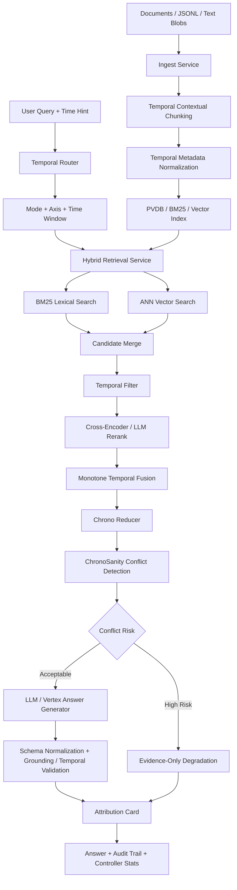

# ChronoRAG

Temporal retrieval-augmented generation for questions where **when** a source was valid is as important as **what** the source says.

ChronoRAG is a research-demo Python RAG scaffold for time-sensitive knowledge
bases. It ingests documents with validity windows, transaction windows,
provenance, authority signals, entities, regions, and units; retrieves evidence
through hybrid lexical/vector search; applies temporal routing and monotone
time-aware fusion; then generates grounded answers with attribution, conflict
checks, and controller telemetry.

The project is not a generic chatbot. It is a temporal reasoning layer for RAG systems that need auditable answers over changing evidence.

## Problem Statement

Standard RAG systems usually rank passages by semantic similarity. That fails when a question depends on time.

Examples:

- “What was Europe’s GDP per capita in 1870?”
- “Which policy was valid during a specific period?”
- “Which source should be trusted when two claims overlap but belong to different revisions?”
- “Was the evidence valid at the requested time, or only published later?”

ChronoRAG addresses this by treating time as a first-class retrieval and generation constraint. Every answer is grounded in passages with explicit temporal metadata and provenance.

## Core Idea

ChronoRAG separates three concerns:

1. **Valid time** — when the claim is true in the real world.
2. **Transaction time** — when the system observed or stored the claim.
3. **Answer time** — the time window requested by the user.

The system retrieves and ranks evidence using these temporal dimensions instead of relying only on embedding similarity.

## Architecture



## Repository Layout

```text
chronorag/
├── app/                    # FastAPI app, routes, schemas, services, dependency wiring
│   ├── routes/             # API endpoints for ingest, retrieve, answer, policy, incidents
│   ├── schemas/            # Pydantic request/response contracts
│   └── services/           # Ingest, retrieve, answer, policy, maintenance logic
├── core/                   # Temporal reasoning, retrieval, routing, generation modules
│   ├── dhqc/               # Retrieval-hop planning helper used by answer orchestration
│   ├── generator/          # Prompting, backend loading, answer generation
│   ├── retrieval/          # BM25, reranking, LLM judge hooks
│   └── router/             # Temporal query routing
├── storage/                # Cache, graph, and PVDB persistence layers
│   ├── cache/              # Redis-backed freshness/cache helpers
│   ├── graph/              # Graph-oriented storage experiments
│   └── pvdb/               # Persistent vector DB models and DAO
├── config/                 # Model, temporal policy, tenant, and axis configuration
├── cli/                    # Command-line ingestion/query workflows
├── data/                   # Sample and experimental data
├── tests/                  # Unit, fixture, and e2e test structure
├── notebooks/              # Research notebooks / Colab workflows
└── scripts/                # Developer automation
```

## What Works

- FastAPI application scaffold with health endpoint and routed services.
- CLI/API style flow for ingesting documents, retrieving evidence, and generating answers.
- Structured ingestion for Maddison/OECD-style world-economy JSONL plus unstructured text fallback.
- Temporal metadata handling through valid windows, transaction windows, entities, regions, units, provenance, authority, and facets.
- Temporal Contextual Chunking architecture: raw evidence stays unchanged while retrieval text receives short document, section, unit, entity, region, and temporal context.
- Hybrid retrieval using BM25 lexical search plus vector retrieval.
- Domain-aware retrieval fan-out for world-economy queries.
- Temporal filtering before final ranking.
- Cross-encoder reranking and optional LLM judge reranking.
- Monotone temporal fusion, so time compliance is part of the final ranking score.
- ChronoSanity-style conflict detection over overlapping evidence.
- Evidence-only fallback when conflicts or weak grounding make generation unsafe.
- Attribution cards with source windows, confidence, alternative windows, and counterfactual timelines.
- Controller telemetry: hop plan, executed hops, latency, token counts, degradation reason, retrieval weights, and router metrics.
- DHQC remains in the runtime path as a small retrieval-hop planning helper, but
  it is not the main architectural contribution of the current checkpoint.
- Config-driven model and policy selection through YAML files.
- Lightweight mode for tests/smoke runs and full mode for model-backed execution.

## What Does Not Work Yet

- This is not a deployed production service.
- No public hosted demo URL is currently documented.
- A controlled diagnostic benchmark is included, but a larger multi-source,
  multi-domain benchmark is still required.
- Demo screenshots are committed under `assets/demo/`.
- The current evaluation report is internal/diagnostic, not a publication-grade
  external benchmark.
- Layer 2 retrieval-only reports are diagnostic and category-aware; generic
  Hit@k must not be presented as final proof, SOTA evidence, or answer-quality
  validation.
- No Dockerfile or production deployment manifest is visible in the repo root.
- Storage currently appears oriented around local persisted state and experimental PVDB abstractions, not a hardened multi-tenant Postgres/pgvector deployment.
- Graph retrieval is not implemented in the current checkpoint. The
  `core/retrieval/graph_paths.py` module is a disabled stub that raises
  `GraphNotConfigured`.
- Authentication, authorization, rate limiting, and tenant isolation are not yet production-grade.
- Observability is designed conceptually through telemetry fields, but no complete OpenTelemetry dashboard/export pipeline is documented.
- The system should not be presented as a finished commercial RAG platform. Present it as a research scaffold and temporal-RAG prototype.

## Scope Note

Temporal Contextual Chunking, temporal retrieval, and grounded answer
validation are the core of the current ChronoRAG checkpoint. DHQC is
still part of the active code path, but it should be described as a supporting
heuristic/controller module rather than the main architectural contribution.
Graph-based retrieval is not part of the current working path.

## Setup

### Option 1: Python virtual environment

```bash
git clone https://github.com/SSKG2602/chronorag.git
cd chronorag

python3.11 -m venv .venv
source .venv/bin/activate

pip install --upgrade pip
pip install -r requirements.txt
```

### Option 2: Conda

```bash
git clone https://github.com/SSKG2602/chronorag.git
cd chronorag

conda env create -f environment.yml
conda activate chronorag
```

## Environment Variables

```bash
export CHRONORAG_LIGHT=1        # 1 for lightweight smoke mode; 0 for full model execution
export CHRONORAG_PROVIDER=vertex # optional provider when CHRONORAG_LIGHT=0
export GOOGLE_CLOUD_PROJECT=your-gcp-project-id
export GOOGLE_CLOUD_LOCATION=us-central1
export VERTEX_MODEL_ID=gemini-2.5-flash
export CHRONORAG_EMBED_FP16=0   # optional experimental local embedding fp16 mode
export HF_TOKEN=hf_xxx          # optional, for gated Hugging Face models
export LLM_ENDPOINT=...         # optional OpenAI-compatible endpoint
export LLM_API_KEY=...          # optional hosted LLM key
export REDIS_URL=...            # optional Redis cache/freshness backend
```

## Optional Vertex AI Provider Mode

Light mode is the default reproducible path:

```bash
export CHRONORAG_LIGHT=1
```

Provider mode is optional and runs only after retrieval has selected evidence:

```bash
pip install -r requirements-provider.txt

gcloud auth application-default login
gcloud config set project your-gcp-project-id
gcloud services enable aiplatform.googleapis.com

export CHRONORAG_LIGHT=0
export CHRONORAG_PROVIDER=vertex
export GOOGLE_CLOUD_PROJECT=your-gcp-project-id
export GOOGLE_CLOUD_LOCATION=us-central1
export VERTEX_MODEL_ID=gemini-2.5-flash
python -m benchmarks.run_provider_smoke
```

Vertex mode uses Application Default Credentials through Google Cloud Vertex AI,
not a Gemini Developer API key. If the SDK, credentials, quota, project, or model
call fails, ChronoRAG returns the deterministic evidence digest with a provider
debug note instead of crashing. See `docs/PROVIDER_MODE.md`.

Provider mode only moves answer synthesis to remote Gemini/Vertex. Local
retrieval still uses a local embedding model. The default embedding model is
`BAAI/bge-small-en-v1.5` with 384 dimensions for laptop-friendly runs. For
Layer 2A cloud retrieval runs, use `BAAI/bge-base-en-v1.5` with 768 dimensions:

```bash
export CHRONORAG_EMBED_MODEL=BAAI/bge-base-en-v1.5
export CHRONORAG_EMBED_DIM=768
```

If you change embedding model or dimension, purge and reingest before querying
because old vectors are incompatible with the new dimension. Persisted indexes
record model and dimension and fail clearly on mismatch:

```bash
python -m cli.chronorag_cli purge
python -m cli.chronorag_cli ingest data/sample/smoke/*
```

Experimental lower-memory embedding mode:

```bash
export CHRONORAG_EMBED_FP16=1
```

This attempts to convert the local SentenceTransformer embedding model to half
precision. If conversion fails, ChronoRAG logs a warning and continues in normal
precision.

## Temporal Contextual Chunking

Temporal Contextual Chunking is ChronoRAG's chunking strategy, inspired by
contextual retrieval but extended for valid-time retrieval, transaction-time
tracking, temporal fusion, ChronoSanity, and attribution. Each chunk keeps
unchanged `raw_text` for grounding while using a separate `retrieval_text` with
short document, section, unit, entity/region, and temporal context for indexing.
This matters because exact-year evidence should outrank broad document windows,
and publication time must not be confused with claim-valid time. See
`docs/TEMPORAL_CONTEXTUAL_CHUNKING.md`.

## Run Locally

```bash
# Start API
python -m app.uvicorn_runner

# Health check
curl http://localhost:8000/healthz
```

## CLI Demo

```bash
# Ingest sample documents
python -m cli.chronorag_cli ingest data/sample/smoke/*

# Ask a temporal question
python -m cli.chronorag_cli answer \
  --query "Western Europe GDP per capita in 1870 1990 international dollars" \
  --mode INTELLIGENT \
  --axis valid

# Clean local ingested artifacts
python -m cli.chronorag_cli purge
```

The larger `data/sample/docs/aihistory*.txt` files are optional full-demo inputs.
Use `data/sample/smoke/*` for CI and laptop-safe validation.

## Expected Demo Output Shape

A successful answer should return an object containing:

```json
{
  "answer": "...",
  "attribution_card": {
    "mode": "INTELLIGENT",
    "axis": "valid",
    "sources": [],
    "confidence": {}
  },
  "controller_stats": {
    "hops_used": 1,
    "hop_plan": {},
    "latency_ms": 0,
    "degraded": null,
    "retrieval_weights": {}
  },
  "audit_trail": [],
  "evidence_only": false,
  "reason": null
}
```

When grounding is weak or conflicts are detected, the system should degrade to an evidence-only response rather than force a confident answer.

## Screenshots / Demo Assets

Demo assets are stored in:

```text
assets/demo/
├── api-health.png
├── cli-ingest.png
├── cli-answer.png
├── attribution-card.png
└── controller-stats.png
```

Minimum screenshots to commit:

1. API health check.
2. CLI ingest command.
3. CLI temporal answer command.
4. Rendered answer JSON showing attribution card and controller stats.
5. One evidence-only degradation example.

## Internal Smoke Benchmark

`benchmarks/temporal_qa_15.jsonl` is an internal smoke benchmark. It validates
that the light-mode pipeline runs over the small smoke dataset. It is not the
public benchmark and should not be used as broad validation evidence.

```bash
CHRONORAG_LIGHT=1 python -m benchmarks.run_ablation \
  --cases benchmarks/temporal_qa_15.jsonl \
  --top-k 5 \
  --candidate-k 50
```

## Temporal Eval v2

Temporal Eval v2 is the main controlled retrieval benchmark. It is built from
multiple source families under `data/raw/temporal_eval_v2/` and generated into
`data/sample/temporal_eval_v2/`. It tests whether ChronoRAG can prefer exact
valid-time evidence over wrong-year, broad-window, transaction-time-only,
metric-confused, and conflict-prone distractors.

The older v1 hard benchmark is archived as a diagnostic benchmark. Temporal Eval
v2 makes `Source Hit@5` more meaningful because it includes multiple source
families. It is still not a broad performance claim, not a publication-grade
benchmark, and not proof of external generalization. Layer 2 generalization
across a second domain remains future work. See
`docs/BENCHMARK_TEMPORAL_EVAL_V2.md`.

Temporal Eval v2 is not a full answer-validation benchmark. Layer 1B now
evaluates answer behavior separately using retrieved evidence, TCC-enriched
evidence cards, Vertex Gemini synthesis in full mode, and deterministic
validation. Layer 2 generalization comes later.

Layer 1B now has a separate answer-validation runner with light and Vertex modes:

```bash
python benchmarks/run_temporal_answer_validation_v2.py --mode light --top-k 5
python benchmarks/run_temporal_answer_validation_v2.py \
  --mode vertex \
  --top-k 5 \
  --case-id av2_q01_western_europe_1870_exact \
  --max-output-tokens 2048
```

Optional dynamic top-k for complex cases:

```bash
python benchmarks/run_temporal_answer_validation_v2.py \
  --mode vertex \
  --top-k 5 \
  --dynamic-top-k \
  --max-output-tokens 2048
```

Comparative Vertex runs can be stored without overwriting the default result
files:

```bash
python benchmarks/run_temporal_answer_validation_v2.py \
  --mode vertex \
  --top-k 5 \
  --max-output-tokens 2048 \
  --result-suffix topk5
```

Light mode is a deterministic CI harness. Vertex mode is the full answer
synthesis benchmark and uses BGE/vector retrieval by default unless
`--skip-vector` is explicitly passed.

Layer 1B validates the provider contract before calling Vertex, extracts fenced
or prose-wrapped JSON, normalizes harmless schema shape drift, validates cited
evidence IDs, applies deterministic temporal-rule checks, and allows one retry
only for provider-output contract failures. A failed retry cannot overwrite a
usable initial response. Provider JSON parse failures are infrastructure/provider
contract failures, not temporal reasoning failures.

The primary full 15-case Vertex result is stored at
`benchmarks/results/temporal_answer_validation_v2_vertex_topk5_results.md`.
It uses `--top-k 5`, which remains the default. A diagnostic dynamic-top-k run
is stored at
`benchmarks/results/temporal_answer_validation_v2_vertex_dynamic_topk_results.md`.
The light harness and dry-run prompt artifacts are stored at
`benchmarks/results/temporal_answer_validation_v2_light_results.md` and
`benchmarks/results/temporal_answer_validation_v2_dry_run_prompts.md`.
The older `temporal_answer_validation_v2_vertex_results.*` files are legacy
single-case smoke output and should not be treated as the main benchmark.

Primary top-k 5 Vertex result:

| Metric | Score |
|---|---:|
| Answer Overall Pass | 0.80 |
| Required Facts Present | 0.80 |
| Expected Evidence Cited | 1.00 |
| Valid-Time Correct | 1.00 |
| Transaction-Time Trap Avoided | 1.00 |
| Provider Contract Pass | 1.00 |
| Grounding Validation Pass | 1.00 |
| Temporal Rule Validation Pass | 0.93 |

The failed top-k 5 cases are q08, q11, and q14. They remain documented as real
answer-behavior limitations. The diagnostic dynamic-top-k run also scores 0.80
overall, but it is exploratory and not the primary result.

The current repair simplified the prompt, added schema normalization, preserved
usable initial provider JSON when repair fails, kept default `--top-k 5`, and
left the embedding model unchanged. Optional `--dynamic-top-k` can expand only
complex cases for experiments. The final cleanup also made q02/q11/q13
validation more behavior-aware: correct valid-time windows, true refusals, and
provider flag shape drift are accepted without weakening grounding or temporal
checks. Latest generated results are stored in `benchmarks/results/`.

## Layer 2 Cross-Domain Comparison Framework

Layer 2 is ready as a comparison framework, not a final result claim. The
downloaded raw pool currently contains 46,503 raw rows/items from five domains:
FRED macro data, market/index data, SEC submissions, Federal Register
regulations, and GitHub software releases. The target controlled benchmark is
5,000 processed evidence rows and 200 benchmark questions.

Layer 2A now compares retrieval methods under the same processed corpus, same
question set, same Gemini/Vertex model in provider mode, and same final
validator:

1. Metadata-aware temporal RAG baseline.
2. ChronoRAG full adapter using TCC, temporal precision, and monotone temporal fusion.

Direct LLM full-context remains available only as a historical/small-context
diagnostic. It is deprecated for serious 5,000-row Layer 2A because it is not a
retrieval baseline and can truncate heavily.

No final Layer 2 performance claim exists yet. The framework is ready for
controlled benchmark construction, estimate-only checks, dry-run prompt review,
and limited provider-backed runs. See `benchmarks/layer2_crossdomain/`.

The current generated Layer 2 corpus path targets 5,000 processed rows and 200
questions. A small diagnostic Vertex pilot exposed a real dense time-series
failure: year-level scoring could retrieve wrong same-year FRED rows for exact
daily Treasury-yield questions. Adapter-side temporal precision fixed the
ChronoRAG-only 5-case pilot from 2/5 to 5/5, and the reusable precision parser
now lives in core TCC so exact dates/timestamps can be preserved before answer
synthesis. This is capability hardening, not a superiority claim.

| Method | Corpus | Questions | Mode | Overall | Evidence | Valid-time | Transaction trap | Conflict | Refusal/partial | Status |
|---|---:|---:|---|---:|---:|---:|---:|---:|---:|---|
| Metadata temporal RAG | pending | pending | pending | pending | pending | pending | pending | pending | pending | framework ready |
| ChronoRAG full | pending | pending | pending | pending | pending | pending | pending | pending | pending | framework ready |

Current Layer 1A light-mode retrieval result:

| Method | Hit@5 Evidence | Top1 Window | Hit@5 Window | Source Family Hit@5 | Distractor Avoidance | Proxy Conflict Correct | Proxy Partial/Refusal Correct | Proxy Behavior Correct | Latency ms |
|---|---:|---:|---:|---:|---:|---:|---:|---:|---:|
| BM25 only | 0.47 | 0.47 | 0.80 | 0.73 | 0.73 | 0.00 | 0.07 | 0.33 | 1.96 |
| Vector only | 0.47 | 0.53 | 0.80 | 0.93 | 0.73 | 0.00 | 0.07 | 0.33 | 1.93 |
| Hybrid without temporal filter | 0.53 | 0.47 | 0.80 | 0.80 | 0.73 | 0.07 | 0.07 | 0.27 | 1.94 |
| Hybrid with temporal filter | 0.67 | 0.60 | 0.93 | 0.80 | 0.73 | 0.07 | 0.13 | 0.47 | 2.00 |
| Hybrid + temporal fusion | 0.60 | 0.80 | 0.93 | 0.87 | 0.93 | 0.07 | 0.07 | 0.60 | 2.00 |
| Hybrid + temporal fusion + rerank | 0.80 | 0.80 | 0.93 | 0.87 | 0.93 | 0.07 | 0.07 | 0.80 | 2.08 |

Run:

```bash
python benchmarks/build_temporal_eval_v2.py
python benchmarks/run_temporal_eval_v2.py --light
```

## Technical Limitations

- Temporal extraction is partly heuristic and depends on document formatting.
- Layer 2 exact-time precision is now preserved in core TCC metadata and used by
  the comparison adapter; broader full-benchmark validation remains pending.
- Domain support is strongest for the world-economy/Maddison-style path; other domains need dedicated policy sets and evaluation.
- Cross-encoder and LLM reranking can be expensive in full mode.
- Local model execution depends on CPU/GPU memory and Hugging Face model access.
- Current benchmark coverage is a small sanity check, not a broad temporal QA evaluation.
- Conflict detection is only as good as the extracted windows, passage granularity, and evidence coverage.
- Production use would require stronger persistence, migrations, background ingestion jobs, auth, monitoring, and deployment automation.

## Future Research Direction

1. **Layer 2 controlled comparison**
   - Run the 5,000-row / 200-question cross-domain comparison against
     metadata-aware temporal RAG, with ChronoRAG full as the ChronoRAG method.
   - Treat diagnostic pilots as debugging evidence, not final benchmark wins.

2. **Temporal retrieval ablations**
   - BM25 only vs ANN only vs hybrid.
   - Hybrid retrieval with and without temporal pre-mask.
   - Monotone temporal fusion vs ordinary rerank score.
   - Compare symbolic temporal precision at year, month, day, and timestamp
     granularity before adding heavier embedding/reranker profiles.

3. **ChronoSanity reliability study**
   - Measure false positives and false negatives for conflict detection.
   - Evaluate when evidence-only degradation changes answer trust.

4. **Policy-set expansion**
   - Add domains beyond world economy: regulations, company filings, research papers, medical guidelines, and financial reports.

5. **Production storage path**
   - Move from local persisted state to Postgres + pgvector with migrations, tenant boundaries, and indexed temporal filters.

6. **Observability layer**
   - Export controller stats, degradation reasons, latency, token counts, and retrieval coverage to dashboards.

7. **Human-readable temporal audit cards**
   - Make the attribution card usable by analysts, not only developers.

## Positioning

ChronoRAG is best presented as:

> A temporal RAG research system that makes validity windows, source revision time, and evidence conflict handling explicit in retrieval and answer generation.

Do not position it as:

> A complete enterprise RAG platform.

## License

Apache-2.0.
