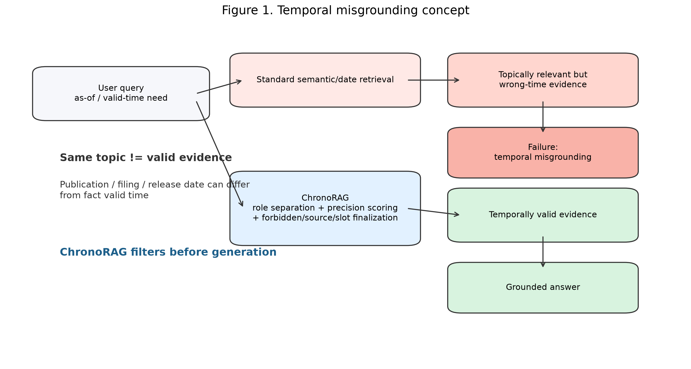
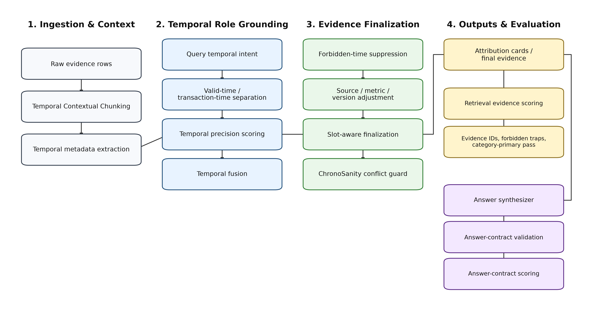
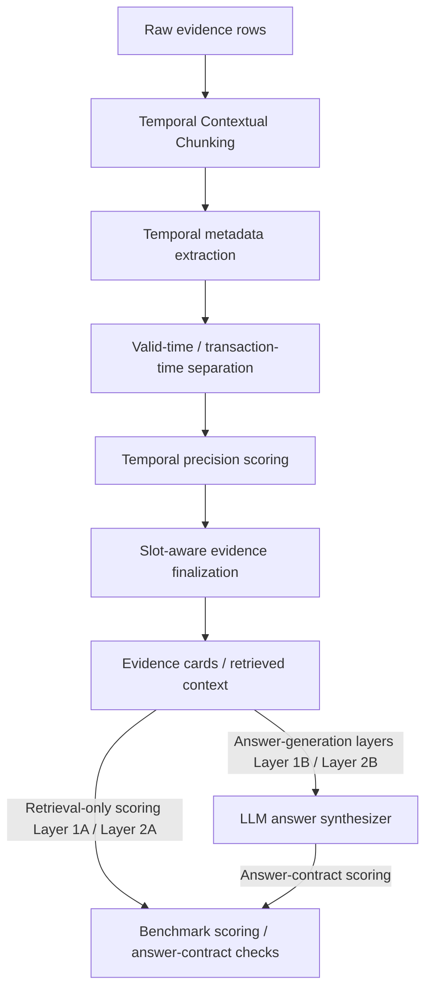
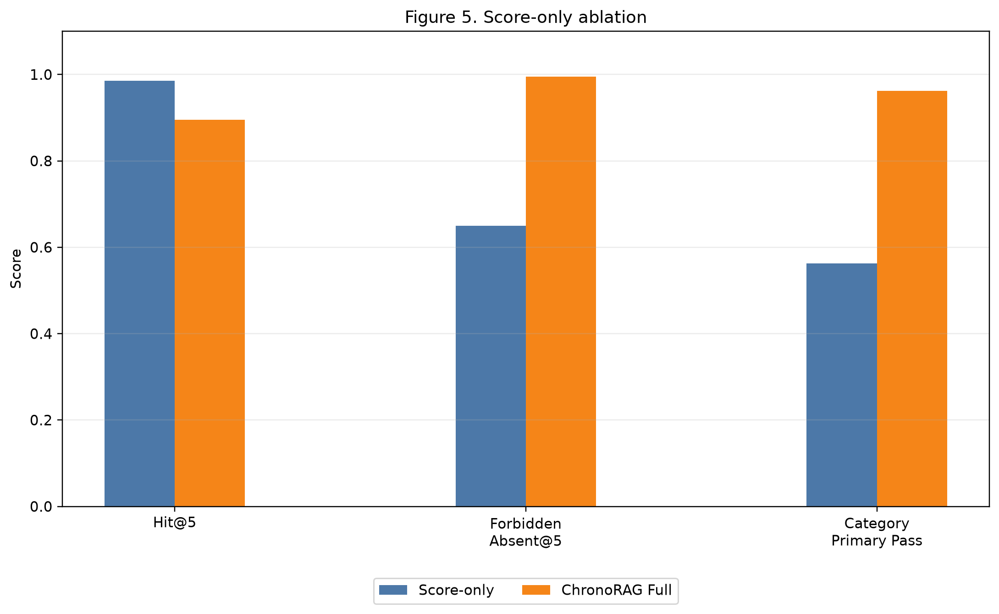
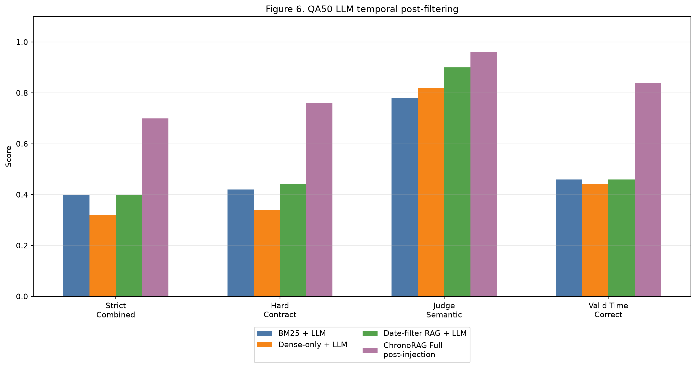
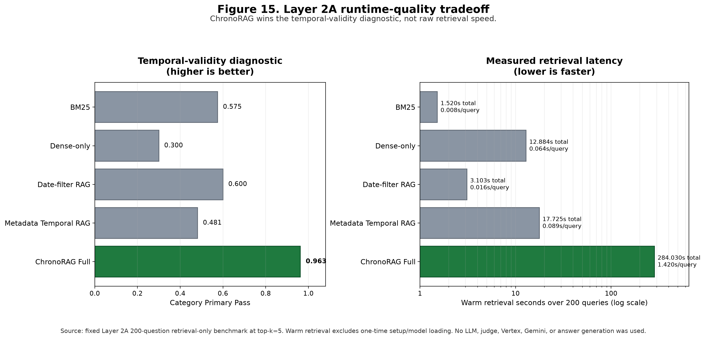
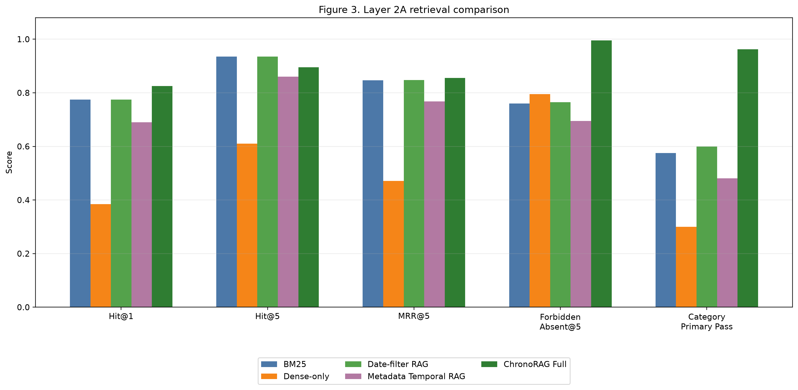

# ChronoRAG-ACV

ChronoRAG-ACV: Temporal-Validity Evidence Selection and Answer-Contract Validation for Retrieval-Augmented Generation.

ChronoRAG-ACV here after ChronoRAG.

It targets temporal failure modes in retrieval-augmented generation: evidence
that is topically relevant but valid at the wrong time, filings or publication
dates mistaken for fact time, broad background rows outranking exact evidence,
and generated answers that cite evidence while misusing its temporal role.

ChronoRAG is a temporal-validity retrieval and grounded answer-validation
framework for RAG over messy multi-role evidence corpora. It reduces
retrieval-layer temporal misgrounding by combining valid-time /
transaction-time separation with temporal precision scoring, forbidden-time
suppression, source- and metric-aware evidence selection, slot-aware
finalization, conflict guarding, and answer-contract validation before evidence
reaches downstream generation. Its contribution is temporally valid evidence
selection and validation, not generic open-domain RAG superiority.

The system separates fact time from publication, filing, release, ingestion, or
other transaction time. The stored results are controlled benchmark evidence for
the evaluation layers described below. They cover temporal retrieval, evidence
selection, answer-contract validation, and component ablations, with
interpretation tied to each layer's dataset, validator, and execution mode.

## Why Temporal RAG Is Hard

Standard RAG often ranks passages by lexical or semantic relevance. Temporal
questions need more than topical match:

- A row can mention the right entity but the wrong date.
- A filing, publication, or release date can be confused with the time a claim
  was true.
- Broad historical context can outrank exact dated evidence.
- A query can explicitly exclude a nearby date.
- A comparison question can need evidence from multiple time slots.
- A generated answer can cite plausible evidence while violating the requested
  valid-time contract.

ChronoRAG makes these cases explicit in retrieval, evidence finalization, and
answer validation.



Figure 1 illustrates the central failure mode: topically relevant retrieved
evidence can be invalid for the requested time. ChronoRAG addresses this before
generation through temporal-validity evidence selection.

## Core Technical Pieces

### Temporal Contextual Chunking

Temporal Contextual Chunking keeps the original evidence row available for
grounding while building retrieval text that states the entity, metric, source,
document context, and temporal role more explicitly. Raw rows often carry too
little context to be retrieved safely on their own. TCC wraps each row with a
compact global context and explicit temporal metadata before embedding, so the
retriever sees both the fact and its time scope.

### `valid_time` vs `transaction_time` separation

ChronoRAG separates when a claim is true from when that claim was filed,
published, released, observed, imported, or ingested. RAG systems often
over-trust prominent dates in a passage even when those dates describe document
lifecycle events rather than the fact being asked about. The separation keeps
publication dates, SEC filing dates, release dates, and ingestion dates from
being mistaken for the valid time of an economic, market, legal, or software
claim.

### Temporal precision scoring

Temporal precision scoring compares the query's requested time against the
candidate evidence at the right granularity: year, month, day, timestamp,
quarter, daypart, range, or fuzzy range. A broad match to the right year or
range is not equivalent to exact dated support when the question asks for a
precise time, so broad-window and nearby-date evidence are penalized when exact
evidence is required for the requested temporal slot.

### Temporal Fusion

Semantic similarity alone can rank a temporally wrong row above the right one.
Temporal Fusion combines semantic score, valid-time fit, interval overlap,
as-of preference, and transaction-role penalties before final ranking.

### Negative/polarity-aware temporal constraints

Some questions specify dates that should be excluded, such as a market movement
that must not be explained with evidence from a nearby date. ChronoRAG treats
target dates and forbidden dates as different retrieval signals instead of
collapsing them into one bag of temporal tokens. Evidence that mentions an
excluded date can be lexically relevant, but the retriever should still demote
it when the question explicitly rules that date out.

### Source/metric-aware ranking adjustment

ChronoRAG uses source family, source file, metric, claim, unit, and version
anchors when the question asks for a specific source or measurement. Temporal
retrieval errors are often source or metric errors in disguise: a GDP row can
be confused with GDP per capita, or a release note can be confused with a
market index series if time alone is scored. This adjustment reduces
temporally plausible evidence with the wrong source family, wrong file, wrong
metric, or wrong version role.

### Slot-aware final evidence assembly

Comparison, before/after, and multi-entity questions need coverage across
multiple evidence slots rather than only the highest-scoring rows overall.
Slot-aware assembly prevents one dominant entity, year, or source family from
filling the final top-k and crowding out the other side of the comparison. A
retrieval set can look strong by score while still failing to support the
actual multi-slot question.

### ChronoSanity

ChronoSanity is the conflict guardrail. It catches cases where multiple rows
are topically relevant but disagree across valid time, transaction time, or
revision history, then forces the answer path to expose that ambiguity instead
of smoothing it away.

### Answer-contract validation

Answer-contract validation checks whether a generated or deterministic answer
cites expected evidence, uses valid time correctly, avoids transaction-time
misuse, handles insufficient evidence, and satisfies provider-output contracts.
A model can cite plausible evidence while still making the wrong temporal
claim, so the validator checks generated answers that look grounded but
violate the requested temporal role, citation contract, or partial/refusal
behavior.

### Attribution Cards

Attribution Cards make the final evidence auditable. Each selected row carries
source ID, valid-time range, transaction-time notes, and confidence metadata so
a reader can inspect why the answer used that evidence.

### Light Mode

Light Mode exists for reproducible local runs. It keeps the temporal evidence
path deterministic and avoids depending on provider behavior when the goal is
to test retrieval and validation mechanics.

### Controlled benchmark correction process

ChronoRAG keeps benchmark correction as part of the research process rather
than treating every early benchmark category as final. Layer 2A revisions
documented where question wording, expected evidence, forbidden evidence, or
corpus availability made an earlier test invalid or under-specified. This
prevents retrieval behavior from being scored against hidden assumptions instead
of aligned question text and available evidence.

### Layer 2A Cross-Domain Retrieval

Layer 2A tests retrieval under mixed domains rather than answer generation. It
scores selected_evidence_ids against expected evidence, forbidden traps,
temporal fit, and category-specific constraints.

### Layer 2B Manual QA

Layer 2B moves from evidence selection to natural-language answers. Expected
evidence can be injected where needed, which isolates answer behavior and
validation quality; it must not be used as a retrieval-quality claim.

## Architecture



Figure 2 shows the retrieval path from Temporal Contextual Chunking through
role grounding, temporal scoring, finalization, attribution, and
answer-contract validation.



The architecture has two evaluation paths. In the retrieval-only path, evidence
cards and retrieved context are scored directly in Layer 1A and Layer 2A, so the
benchmark evaluates selected evidence IDs rather than generated prose. In the
answer-synthesis path, retrieved evidence is passed to the LLM answer
synthesizer; then answer-contract checks evaluate citations, valid-time use,
transaction-time misuse, partial/refusal behavior, and provider-output shape in
Layer 1B and Layer 2B.

Core pieces:

| Component                                    | Role                                                                                                                                                                                                                                           |
| -------------------------------------------- | ---------------------------------------------------------------------------------------------------------------------------------------------------------------------------------------------------------------------------------------------- |
| Temporal Contextual Chunking                 | Preserves raw evidence for grounding while adding structured retrieval text with temporal, entity, unit, source, and document context.                                                                                                         |
| `valid_time` / `transaction_time` separation | Keeps when a claim is true separate from when it was filed, published, released, observed, or ingested.                                                                                                                                        |
| Temporal precision scoring                   | Scores year, month, day, timestamp, range, fuzzy range, quarter, and daypart matches before answer synthesis.                                                                                                                                  |
| Polarity and negative constraints            | Treats target dates differently from excluded dates such as `not 1990-03-28`.                                                                                                                                                                  |
| Source / metric normalization                | Rewards source-family, source-file, metric, claim, and version anchors when the question asks for them.                                                                                                                                        |
| Slot-aware finalization                      | Assembles evidence for comparison and multi-slot questions so one side does not dominate top-k.                                                                                                                                                |
| Benchmark scoring / answer-contract checks   | Scores retrieval-only evidence cards directly for Layer 1A and Layer 2A, and checks cited evidence, valid-time use, transaction-time misuse, partial/refusal behavior, and provider-output contracts after synthesis in Layer 1B and Layer 2B. |

Retrieval-only layers score evidence cards directly. LLM answer synthesis is
used only for answer-generation layers, with answer-contract checks applied
after synthesis. Retrieval scoring and deterministic checks can be run without
Vertex.

## Evaluation Map

| Layer    | Scope                                 | What It Tests                                                                                    | Boundary                                                                                                           |
| -------- | ------------------------------------- | ------------------------------------------------------------------------------------------------ | ------------------------------------------------------------------------------------------------------------------ |
| Layer 1A | Temporal retrieval benchmark          | Whether retrieval finds temporally correct evidence and avoids temporal distractors.             | Retrieval-focused only.                                                                                            |
| Layer 1B | Temporal answer validation            | Whether generated or light-mode answers satisfy a grounded temporal answer contract.             | Answer-contract validation over controlled cases.                                                                  |
| Layer 2A | Cross-domain retrieval-only benchmark | Whether retrieval behavior holds across a selected cross-domain corpus and v3 aligned questions. | Selected evidence IDs only; no natural-language answer scoring.                                                    |
| Layer 2B | Natural-language temporal QA          | 50 manually designed questions using ChronoRAG + Vertex + dynamic top-k + answer validation.     | Answer synthesis and validation with expected evidence available where needed; retrieval quality remains Layer 2A. |

## Claims And Boundaries

Current benchmark evidence supports:

- The Layer 2A retrieval-only result provides controlled evidence that
  ChronoRAG selects cleaner final evidence than standard BM25, Dense-only,
  Date-filter RAG, and Metadata Temporal RAG baselines under temporal-role,
  source/metric, forbidden-evidence, and slot-coverage constraints.
- ChronoRAG can perform grounded temporal answer synthesis in Layer 2B when
  expected evidence is available to the answer-generation path.
- Layer 2B exposes remaining error modes in valid-time precision, behavior
  labels, and unsupported detail control.

Interpretation boundaries:

- Layer 2A is the retrieval-quality layer. It scores selected evidence IDs,
  forbidden-evidence handling, source/metric constraints, and slot coverage.
- Layer 2B is the answer-synthesis and validation layer. It measures whether
  grounded answers satisfy the expected evidence contract.
- Claims about new datasets, source families, or deployment settings should be
  evaluated through the same layer-specific result structure.

## Current Paper-Ready Result Interpretation

The Layer 2A 200-case result is the main retrieval comparison. It compares
BM25, Dense-only, Date-filter RAG, Metadata Temporal RAG, and ChronoRAG Full on
the same 5,000-row corpus, same 200 queries, same top-k=5 boundary, and the
same retrieval-only evaluator. The contribution is not generic retrieval
improvement; it is temporally valid evidence selection.

ChronoRAG does not maximize broad Hit@5. BM25 and Date-filter RAG both reach
Hit@5 of 0.9350, while ChronoRAG Full reaches Hit@5 of 0.8950. ChronoRAG Full
is stronger on temporal-validity retrieval diagnostics: Hit@1 is 0.8250,
MRR@5 is 0.8554, Forbidden Absent@5 is 0.9950, and Category Primary Pass is
0.9625. This supports temporal-validity retrieval rather than a broad claim
that ChronoRAG is always the highest-recall retriever.

The latest paper-ready tables are indexed at
`docs/paper_assets/chrono_tables_index.md`, including the four main tables,
Wilson confidence-interval variants, ChronoRAG QA50 extracted values, top-k
sensitivity, and not-run validation notes for fusion-weight sensitivity and
reranker ablation.

### Metric Definitions

- Hit@k: the fraction of cases where at least one expected or acceptable
  evidence ID appears in the top-k selected evidence set.
- MRR@5: mean reciprocal rank of the first expected or acceptable evidence ID
  within the top-5 selected evidence set.
- Forbidden Absent@5: the fraction of cases where forbidden evidence IDs are
  absent from the top-5 selected evidence set.
- Category Primary Pass: the benchmark's category-specific primary diagnostic,
  such as slot coverage, source or metric correctness, forbidden-evidence
  exclusion, or exact temporal preference depending on the question category.
- Strict Combined Pass: the Layer 2B answer-level pass requiring both
  deterministic hard-contract validation and LLM judge pass.
- Deterministic Hard-Contract Pass: the rule-based answer-contract validation
  pass over citations, required fields, expected evidence, valid-time use, and
  schema/grounding constraints.
- Judge Semantic Pass: the LLM judge's semantic answer-correctness signal.
- Valid Time Correct: the answer-level check that the response uses the
  requested valid time rather than an unrelated transaction, publication,
  filing, release, or ingestion time.

Forbidden Absent@5 and Category Primary Pass are constraint-sensitive
diagnostics for temporal-validity retrieval. They are not intended to replace
standard IR metrics; they complement Hit@k and MRR@5 by measuring
temporal-invalidity exclusion and source/category correctness.

### Annotation And Baseline Fairness

The current artifact records benchmark labels as fixed JSONL fields. Expected
evidence IDs, forbidden evidence IDs, and category-primary labels are
author-created and treated as fixed before method scoring. Large-scale
independent annotation is not included in this version and is listed as a
limitation.

Where applicable, retrieval methods use the same corpus, same queries, same
top-k, same evaluator, and same candidate corpus. BM25, Dense-only, and
Date-filter RAG do not use Temporal Contextual Chunking, temporal metadata
scoring, temporal fusion, forbidden-time suppression, valid-time /
transaction-time separation, or ChronoRAG finalization logic. Gold expected
evidence IDs were not included in the LLM baseline prompts.

### Retrieval Score Optimization Degrades Temporal Validity

The Score-only ablation achieved the highest raw Hit@5 at 0.9850, but
Forbidden Absent@5 fell to 0.6500 and Category Primary Pass fell to 0.5625.
ChronoRAG Full achieved lower broad Hit@5 at 0.8950 but much stronger
Forbidden Absent@5 at 0.9950 and Category Primary Pass at 0.9625. This
demonstrates that unconstrained retrieval score optimization and
temporal-validity retrieval are different objectives.



The Score-only ablation achieves higher broad Hit@5 but much worse Forbidden
Absent@5 and Category Primary Pass, showing that score optimization and
temporal validity diverge.

### LLM Post-Filtering Does Not Replace Retrieval-Layer Temporal Grounding

BM25 + LLM, Dense-only + LLM, and Date-filter RAG + LLM were evaluated with
the same 50 QA cases, same corpus, same top-k=5, same Gemini 2.5 Flash model,
same temperature 0.0, same prompt template, and same validator/judge settings.
Despite explicit instructions to distinguish valid time from transaction time,
these baselines reached only 0.4000, 0.3200, and 0.4000 strict combined pass
respectively. ChronoRAG Full's prior answer-level result reached 0.7000 strict
combined pass, 0.7600 hard-contract pass, 0.9600 judge semantic pass, 0.9800
expected evidence citation, and 0.8400 valid-time correctness.

Baseline methods are evaluated without evidence injection. ChronoRAG
pre-injection evidence availability is the fair retrieval-availability
comparison point. ChronoRAG post-injection answer-level results are reported
separately to show performance when expected evidence is available to the
generator. In the extracted QA50 artifacts, pre-injection any expected evidence
is 0.7400 (37/50), pre-injection all expected evidence is 0.6400 (32/50), and
post-injection evidence available is 1.0000 (50/50).

### QA50 LLM Post-Filtering Baseline Comparison

| Method                | Retrieval Hit@5 | Strict Combined Pass | Hard-Contract Pass | Judge Semantic Pass | Valid Time Correct | Expected Evidence Cited |
| --------------------- | --------------: | -------------------: | -----------------: | ------------------: | -----------------: | ----------------------: |
| BM25 + LLM            |          0.6400 |               0.4000 |             0.4200 |              0.7800 |             0.4600 |                  0.5600 |
| Dense-only + LLM      |          0.5200 |               0.3200 |             0.3400 |              0.8200 |             0.4400 |                  0.4400 |
| Date-filter RAG + LLM |          0.6600 |               0.4000 |             0.4400 |              0.9000 |             0.4600 |                  0.5800 |



Baselines are no-injection LLM post-filtering runs. ChronoRAG Full is the
post-injection answer setting; pre-injection retrieval availability is reported
separately.

These baselines use standard retrieval followed by the same LLM prompted to
distinguish valid time from transaction time. They reach only 32-40% strict
combined pass, showing that temporal role handling cannot be treated only as a
downstream prompting problem in this evaluated setting.

### QA50 ChronoRAG Answer-Level Extracted Values

| ChronoRAG QA50 Metric                          |          Value |
| ---------------------------------------------- | -------------: |
| Strict combined pass                           |  35 / 50 = 70% |
| Deterministic hard-contract pass               |  38 / 50 = 76% |
| Judge semantic pass                            |  48 / 50 = 96% |
| Expected evidence cited                        |  49 / 50 = 98% |
| Valid time correct                             |  42 / 50 = 84% |
| Pre-injection retrieval, any expected evidence |  37 / 50 = 74% |
| Pre-injection retrieval, all expected evidence |  32 / 50 = 64% |
| Post-injection evidence available              | 50 / 50 = 100% |

Baseline LLM post-filtering methods are evaluated without evidence injection.
ChronoRAG pre-injection retrieval availability is the fair
retrieval-availability comparison point. ChronoRAG post-injection answer-level
results are reported separately to show answer-contract behavior when expected
evidence is available to the generator. Do not compare ChronoRAG
post-injection 100% evidence availability as if it were equivalent to baseline
retrieval Hit@5. Layer 2A remains the primary retrieval-quality benchmark;
Layer 2B/QA50 measures answer synthesis and temporal answer-contract behavior.

### QA50 Answer-Level Comparison

| Method                                         | Evidence Available / Retrieval Hit@5 | Strict Combined Pass | Hard-Contract Pass | Judge Semantic Pass | Expected Evidence Cited | Valid Time Correct |
| ---------------------------------------------- | -----------------------------------: | -------------------: | -----------------: | ------------------: | ----------------------: | -----------------: |
| BM25 + LLM                                     |                               0.6400 |               0.4000 |             0.4200 |              0.7800 |                  0.5600 |             0.4600 |
| Dense-only + LLM                               |                               0.5200 |               0.3200 |             0.3400 |              0.8200 |                  0.4400 |             0.4400 |
| Date-filter RAG + LLM                          |                               0.6600 |               0.4000 |             0.4400 |              0.9000 |                  0.5800 |             0.4600 |
| ChronoRAG Full — pre-injection retrieval       |              0.7400 any / 0.6400 all |                  n/a |                n/a |                 n/a |                     n/a |                n/a |
| ChronoRAG Full — post-injection answer setting |                               1.0000 |               0.7000 |             0.7600 |              0.9600 |                  0.9800 |             0.8400 |

[Figure 7: Injection fairness split](rpartifacts/figures/fig7_injection_fairness_split.png)
separates pre-injection retrieval availability from the post-injection answer
setting so QA50 answer-level results are not mistaken for retrieval-only
evidence selection.

The answer-level comparison shows that standard retrieval plus LLM temporal
post-filtering does not recover ChronoRAG-level strict temporal QA performance.
BM25 + LLM and Date-filter RAG + LLM reach 0.4000 strict combined pass,
Dense-only + LLM reaches 0.3200, while ChronoRAG Full reaches 0.7000 in the
prior post-injection answer setting. The pre-injection retrieval row is
reported separately to keep the retrieval-availability comparison fair.

## Layer 1A: Temporal Eval v2

Layer 1A is a controlled temporal retrieval benchmark. It asks whether the
retriever can select the right evidence when time is part of the query, not just
whether it can find a semantically related passage.

It tests exact valid-time retrieval, wrong-year and wrong-time traps, broad
window distractors, valid-time versus transaction-time behavior, proxy conflict
cases, and partial/refusal proxy behavior. Layer 1A checks whether the system
finds evidence that is true at the requested time and avoids nearby evidence
that merely looks relevant.

Benchmark files:

- `benchmarks/run_temporal_eval_v2.py`
- `benchmarks/temporal_eval_v2_15.jsonl`
- `data/sample/temporal_eval_v2/`
- `benchmarks/results/temporal_eval_v2_results.md`
- `benchmarks/results/temporal_eval_v2_results.json`

Stored light-mode result:

| Method                            | Hit@5 Evidence | Top1 Window | Hit@5 Window | Source Family Hit@5 | Distractor Avoidance | Proxy Behavior Correct |
| --------------------------------- | -------------: | ----------: | -----------: | ------------------: | -------------------: | ---------------------: |
| Hybrid + temporal fusion + rerank |           0.80 |        0.80 |         0.93 |                0.87 |                 0.93 |                   0.80 |

These are controlled benchmark results for the 15-case Temporal Eval v2 setting.

## Layer 1B: Temporal Answer Validation

Layer 1B evaluates answer contract behavior, not only retrieval. It checks
whether an answer cites expected evidence, uses valid time correctly, avoids
treating transaction time as fact time, follows partial/refusal behavior when
the evidence is insufficient, and returns the required provider-output shape.

Execution paths:

- Dry-run prompts: prompt construction only; no provider call.
- Light mode: deterministic, CI-safe answer harness.
- Vertex mode: provider-backed answer synthesis with strict schema, grounding,
  and temporal-rule validation.

Benchmark files:

- `benchmarks/run_temporal_answer_validation_v2.py`
- `benchmarks/temporal_answer_validation_v2_15.jsonl`
- `benchmarks/results/temporal_answer_validation_v2_*.md`
- `benchmarks/results/temporal_answer_validation_v2_*.json`

The primary stored Vertex top-k 5 result is
`benchmarks/results/temporal_answer_validation_v2_vertex_topk5_results.md`.
It reports `0.80` answer overall pass, `1.00` expected evidence citation,
`1.00` valid-time correctness, `1.00` transaction-time trap avoidance, `1.00`
provider contract pass, and `1.00` grounding validation pass in this tested
setting. Non-passing cases remain part of the documented answer-behavior
boundary.

## Layer 2A: Cross-Domain Retrieval-Only

Layer 2A is a controlled cross-domain retrieval-only benchmark. Layer 2A
scores evidence selection, not answer prose. Its metrics operate on
selected_evidence_ids and therefore measure whether the retriever selected the
right temporally valid rows, avoided forbidden traps, and satisfied category
constraints. Generated wording, fluency, and natural-language reasoning are
evaluated separately in Layer 2B.

### Layer 2A dataset and method setup

Dataset and corpus context:

- The raw pool had about 46,503 detected rows or items across FRED macro,
  market/index, SEC submissions, Federal Register, and GitHub release source
  families.
- The Layer 2A benchmark uses a selected 5,000-row cross-domain corpus for
  controlled evaluation.
- The final Layer 2A benchmark uses 200 v3 aligned questions.
- The 5,000-row corpus used during benchmark execution is generated/working
  data and may not be fully tracked in Git because generated corpus artifacts
  are excluded from normal public commits.
- The public repository contains question definitions, builders, validators,
  sample corpus files, final result artifacts, and reproducibility commands.

Source families:

- FRED macro
- Market/index series
- SEC submissions
- Federal Register
- GitHub releases

Tracked and generated data are intentionally distinguished:

- Tracked sample corpus:
  `benchmarks/layer2_crossdomain/data/layer2_corpus.sample.jsonl`
- Generated/working full corpus:
  `benchmarks/layer2_crossdomain/data/layer2_corpus.jsonl`
- Final question file:
  `benchmarks/layer2_crossdomain/data/layer2_questions.jsonl`
- Raw-pool scale manifest:
  `benchmarks/layer2_crossdomain/data/raw_pool_manifest.json`

Methods compared in the latest paper-ready standard comparison:

- BM25
- Dense-only
- Date-filter RAG
- Metadata Temporal RAG
- ChronoRAG Full

Scoring boundary:

- As above, Layer 2A is evidence-selection only; answer wording is evaluated
  separately in Layer 2B.
- Diagnostic categories are separated where applicable so source, temporal,
  slot, forbidden-evidence, and insufficiency behavior can be interpreted
  without blending them into one opaque aggregate.

### Data used in Layer 2A

Layer 2A starts from a raw pool of about 46,503 detected rows or items. The
controlled benchmark uses a selected 5,000-row corpus and 200 v3 aligned
questions built against that selected corpus.

The source families represented in the Layer 2A setup are FRED macro,
market/index series, SEC submissions, Federal Register, and GitHub releases.
Those families are used to test whether temporal retrieval behavior survives
across macroeconomic, market, filing, regulatory, and software-release
contexts.

The 5,000-row full corpus is generated working data. A full working corpus may
exist at `benchmarks/layer2_crossdomain/data/layer2_corpus.jsonl` during local
or GCP benchmark execution. The public repository keeps sample corpus files
and final result artifacts so the benchmark boundary is visible without
committing every generated data row.

New Layer 2B questions must be built from the selected 5,000-row corpus, not
the 46,503-row raw pool, unless the corpus is intentionally rebuilt and the
question/evidence contracts are regenerated against that new corpus.

### Layer 2A public source/provenance links

The Layer 2A raw pool was assembled from public cross-domain source families
before selecting the 5,000-row controlled evaluation corpus. These links
identify the public source families used for verification and rebuilding; they
are not a claim that the generated 5,000-row corpus is directly committed in
full.

| Source family            | Used for                                                                                       | Public source/provenance link                                                                                                                        |
| ------------------------ | ---------------------------------------------------------------------------------------------- | ---------------------------------------------------------------------------------------------------------------------------------------------------- |
| FRED macro series        | Federal funds rate and 10-year Treasury yield series such as `FEDFUNDS` and `DGS10`.           | `https://fred.stlouisfed.org/docs/api/fred/v2/index.html`; `https://fred.stlouisfed.org/series/FEDFUNDS`; `https://fred.stlouisfed.org/series/DGS10` |
| FRED market/index series | Market/index series used in the cross-domain pool, including `SP500`, `DJIA`, and `NASDAQCOM`. | `https://fred.stlouisfed.org/series/SP500`; `https://fred.stlouisfed.org/series/DJIA`; `https://fred.stlouisfed.org/series/NASDAQCOM`                |
| SEC EDGAR submissions    | Company filing/submission metadata and filing-time examples.                                   | `https://www.sec.gov/search-filings/edgar-application-programming-interfaces`                                                                        |
| Federal Register         | Federal agency rule/document records and publication-time examples.                            | `https://www.federalregister.gov/developers/documentation/api/v1`                                                                                    |
| GitHub releases          | Repository release records and software-version temporal examples.                             | `https://docs.github.com/rest/releases/releases`                                                                                                     |

The reported Layer 2A metrics were produced on the selected 5,000-row
evaluation corpus derived from these raw/source families. The README separates
raw source provenance, generated corpus artifacts, tracked samples, question
files, validators, and final result artifacts so the benchmark boundary is
auditable.

Final public result files:

- `benchmarks/layer2_crossdomain/results/layer2_retrieval_only_v3_200_eval.md`
- `benchmarks/layer2_crossdomain/results/layer2_retrieval_only_v3_200_eval.json`
- `benchmarks/layer2_crossdomain/results/layer2_ablation_v3_ablation200.md`
- `benchmarks/layer2_crossdomain/results/layer2_ablation_v3_ablation200.json`

Layer 2A v3 retrieval-only standard comparison:

| Method                | Cases |  Hit@1 |  Hit@5 |  MRR@5 | Forbidden Absent@5 | Category Primary Pass |
| --------------------- | ----: | -----: | -----: | -----: | -----------------: | --------------------: |
| BM25                  |   200 | 0.7750 | 0.9350 | 0.8467 |             0.7600 |                0.5750 |
| Dense-only            |   200 | 0.3850 | 0.6100 | 0.4710 |             0.7950 |                0.3000 |
| Date-filter RAG       |   200 | 0.7750 | 0.9350 | 0.8475 |             0.7650 |                0.6000 |
| Metadata Temporal RAG |   200 | 0.6900 | 0.8600 | 0.7678 |             0.6950 |                0.4813 |
| ChronoRAG Full        |   200 | 0.8250 | 0.8950 | 0.8554 |             0.9950 |                0.9625 |

### Runtime Snapshot

Runtime was measured on the fixed Layer 2A 200-question retrieval-only
benchmark at top-k=5. Warm retrieval time excludes one-time model/index loading
where applicable. No LLM, judge, Vertex, Gemini, or answer-generation call was
used.

Paper-ready runtime table:
[`docs/paper_assets/table_runtime_layer2a_retrieval.md`](docs/paper_assets/table_runtime_layer2a_retrieval.md)

In this Layer 2A standard-comparison setup, Dense-only is the only baseline
that uses the `BAAI/bge-small-en-v1.5` embedding model. BM25, Date-filter RAG,
Metadata Temporal RAG, and the measured ChronoRAG Full Layer 2A adapter do not
rank by dense embedding similarity.





BM25 and Date-filter RAG achieve higher broad Hit@5, while ChronoRAG Full is
strongest on Hit@1, MRR@5, Forbidden Absent@5, and Category Primary Pass. The
result should therefore be read as evidence for temporally valid evidence
selection, not generic broad-recall superiority.

[Figure 4: Temporal-validity diagnostics](rpartifacts/figures/fig4_temporal_validity_diagnostics.png)
separates broad retrieval recall from diagnostics that capture forbidden
evidence absence, category-primary behavior, and temporal-validity constraints.

### What the Layer 2A result means

In the controlled v3 benchmark, ChronoRAG Full had the strongest Hit@1, MRR@5,
Forbidden Absent@5, and Category Primary Pass. BM25 and Date-filter RAG had
higher broad Hit@5, which is useful context: broad retrieval recall is not
temporal validity. Relevant retrieval alone is not always enough when the final
evidence set must satisfy temporal role, source/metric, slot coverage, and
forbidden-evidence constraints. Less precise finalization or constraint
handling can allow wrong-role or forbidden evidence to remain in the selected
evidence set.

These results support the tested claim that explicit temporal roles and final
evidence gating improve controlled temporal retrieval behavior on this Layer 2A
benchmark. They do not evaluate natural-language answer quality, provider
behavior, or untested production workloads.

### Layer 2B Full-50 Answer Validation

Layer 2B full-50 artifacts:

- `benchmarks/layer2_crossdomain/data/layer2b_manual_50_qa.jsonl`
- `benchmarks/layer2_crossdomain/results/layer2b_manual_50_qa_summary.md`
- `benchmarks/layer2_crossdomain/results/layer2b_chronorag_full_layer2b_full50_vertex_final_results.md`
- `benchmarks/layer2_crossdomain/results/layer2b_judge_layer2b_full50_judge_final_results.md`
- `benchmarks/layer2_crossdomain/results/layer2b_full50_manual_audit.md`

| Layer 2B metric                              |         Score |
| -------------------------------------------- | ------------: |
| Deterministic hard-contract pass             | 38 / 50 = 76% |
| LLM judge overall pass                       | 38 / 50 = 76% |
| LLM judge semantic pass                      | 48 / 50 = 96% |
| Strict combined pass                         | 35 / 50 = 70% |
| Manually accepted validator-strictness cases |             3 |
| Manual-audited acceptable pass               | 41 / 50 = 82% |

The strict combined pass is the conservative score. The manual-audited
acceptable pass accepts 3 cases where hard validation failed but judge and
manual review agreed the answer was semantically correct. Expected-evidence
injection was used for the post-injection answer setting, so Layer 2B measures
answer synthesis and validation separately from retrieval quality. Retrieval
quality is reported in Layer 2A and in the QA50 pre-injection evidence
availability row.

The final full-50 runs were clean: answer provider errors were 0, judge errors
were 0, judge provider failures were 0, and judge parse failures were 0. The
remaining failures are still listed in the manual audit note.

## Layer 2A Ablation Summary

The ablation runner removes one component at a time where possible and scores
the same 200 v3 questions.

| Variant                           | What Is Removed or Changed                                                                       | Why It Matters                                                            |
| --------------------------------- | ------------------------------------------------------------------------------------------------ | ------------------------------------------------------------------------- |
| `chronorag_full`                  | Full Layer 2A ChronoRAG path.                                                                    | Reference setting for component ablations.                                |
| `chronorag_no_tcc`                | Uses raw row text instead of Temporal Contextual Chunking retrieval text.                        | Tests whether enriched temporal/entity/source context helps retrieval.    |
| `chronorag_no_temporal_precision` | Disables explicit temporal precision scoring and negative exact-time suppression.                | Tests exact-date ranking and wrong-time trap handling.                    |
| `chronorag_no_transaction_role`   | Disables final cleanup that demotes transaction-time-only evidence when valid time is requested. | Tests separation of fact time from filing/publication/release time.       |
| `chronorag_no_source_metric`      | Disables source and metric adjustment in finalization.                                           | Tests source-family, source-file, metric, claim, and version constraints. |
| `chronorag_no_slot_assembler`     | Disables slot-aware evidence assembly.                                                           | Tests multi-slot and cross-domain comparison coverage.                    |
| `chronorag_score_only`            | Uses fused ranking without finalization components.                                              | Tests whether retrieval finalization adds behavior beyond score ordering. |
| `metadata_temporal_rag`           | Metadata-oriented temporal retrieval baseline.                                                   | Provides a comparison point for selected-evidence behavior.               |

### Stored ablation scores

These scores are copied from
`benchmarks/layer2_crossdomain/results/layer2_ablation_v3_ablation200.md`.

| Variant                           | Cases | Generic Hit@1 | Generic Hit@5 | Forbidden absent@5 | Category primary pass | Delta vs chronorag_full | Interpretation                                                           |
| --------------------------------- | ----: | ------------: | ------------: | -----------------: | --------------------: | ----------------------: | ------------------------------------------------------------------------ |
| `chronorag_full`                  |   200 |        0.8250 |        0.8950 |             0.9950 |                0.9625 |                  0.0000 | Reference setting for this ablation run.                                 |
| `chronorag_no_tcc`                |   200 |        0.8350 |        0.8950 |             0.9950 |                0.9625 |                  0.0000 | Same overall category-primary pass as full in this controlled run.       |
| `chronorag_no_temporal_precision` |   200 |        0.7500 |        0.8500 |             0.9450 |                0.7500 |                 -0.2125 | Lower category-primary pass when precision handling is disabled.         |
| `chronorag_no_transaction_role`   |   200 |        0.8250 |        0.8950 |             0.9950 |                0.9625 |                  0.0000 | Same overall category-primary pass as full in this controlled run.       |
| `chronorag_no_source_metric`      |   200 |        0.8300 |        0.8900 |             1.0000 |                0.9688 |                  0.0062 | Source/metric ablation did not reduce overall primary pass in this run.  |
| `chronorag_no_slot_assembler`     |   200 |        0.8300 |        0.8900 |             0.8150 |                0.7750 |                 -0.1875 | Lower forbidden-absence and category-primary pass without slot assembly. |
| `chronorag_score_only`            |   200 |        0.8150 |        0.9850 |             0.6500 |                0.5625 |                 -0.4000 | High generic Hit@5 but lower final selected-evidence behavior.           |
| `metadata_temporal_rag`           |   200 |        0.6900 |        0.8600 |             0.6950 |                0.4813 |                 -0.4813 | Independent metadata baseline with lower category-primary pass here.     |

The ablation score table is the fastest way to see which component removals
changed behavior in the controlled 200-question Layer 2A v3 benchmark. The
per-ablation descriptions below explain why those score differences matter:
they connect metric changes to the expected failure modes for retrieval text,
temporal precision, transaction roles, source/metric anchors, slot coverage,
and final eligibility-gated selection.

### `chronorag_no_tcc`

This ablation uses raw row text instead of Temporal Contextual Chunking
retrieval text, removing the enriched framing that names temporal metadata,
source context, entity context, and document context around the evidence row.
Raw rows can be underspecified when values, dates, release labels, or filings
need surrounding context to be interpreted correctly, so retrieval can over-rank
rows that share surface tokens but do not support the requested temporal claim.
The result isolates the value of contextual retrieval text and structured row
framing before later scoring and finalization operate on candidate evidence.

### `chronorag_no_temporal_precision`

This ablation disables explicit temporal precision scoring, including exact
day, month, year, timestamp, range, and nearby-time handling before final
evidence assembly. Evidence from a nearby date, broad range, or less specific
temporal granularity can then outrank exact evidence for the requested time, and
wrong-time suppression drops when the question depends on exact
temporal alignment. The result shows how much of the controlled retrieval
behavior comes from explicit temporal precision rather than ordinary semantic
or metadata relevance.

### `chronorag_no_transaction_role`

This ablation disables the final cleanup that demotes transaction-time-only
evidence when the question asks for valid-time evidence. Document lifecycle
dates can remain in the final top-k as if they supported the requested fact
time, which matters for SEC, Federal Register, release, and imported-data cases
where transaction dates are prominent. The result tests whether valid-time and
transaction-time separation is only descriptive metadata or changes selected
evidence behavior in the benchmark.

### `chronorag_no_source_metric`

This ablation disables source and metric adjustment in finalization, including
source-family, source-file, metric, claim, unit, and version anchors where those
constraints are available. The retriever can still select temporally plausible
evidence, but the evidence may come from the wrong source family, file, metric,
or version role; a row can match the date while supporting a different
measurement or source lineage. The result separates temporal matching from the
source and measurement constraints needed for evidence contracts that ask for a
specific series, filing family, release family, metric, or version.

### `chronorag_no_slot_assembler`

This ablation disables slot-aware evidence assembly for multi-slot questions,
so the path relies more heavily on global ranking instead of ensuring coverage
across requested entities, dates, sources, or comparison sides. One dominant
slot can fill the final top-k while another required slot is absent, letting a
comparison question retrieve many relevant rows but still miss the coverage
needed to answer the actual question. The result tests whether final evidence
assembly is needed for multi-slot temporal retrieval beyond independently
scoring each candidate row.

### `chronorag_score_only`

This ablation uses fused score ordering without the final eligibility-gated
selection behavior provided by the full finalization path. High-scoring rows
that are topically or temporally close can remain in the final set even when
they violate a forbidden-evidence, wrong-role, source/metric, slot-coverage, or
insufficiency constraint. The result tests whether fused ranking alone is
enough or whether controlled temporal retrieval needs a final evidence gate
after scores are computed.

### `metadata_temporal_rag`

This independent temporal metadata retrieval baseline is not a deliberately
reduced copy of ChronoRAG. It uses temporal metadata to retrieve and rank
evidence, but it does not include the full ChronoRAG combination of TCC,
precision handling, temporal-role cleanup, source/metric adjustment, slot-aware
assembly, and final eligibility gating. The baseline can retrieve many relevant
rows while still allowing wrong-role, forbidden, missing-slot, or
source/metric-mismatched evidence into the final selected set, giving a
reference point for which behaviors depend on additional finalization and
contract-aware retrieval steps.

Stored result:

- `benchmarks/layer2_crossdomain/results/layer2_ablation_v3_ablation200.md`

Read `benchmarks/layer2_crossdomain/results/layer2_ablation_v3_ablation200.md`
for the stored metrics and case-level interpretation. The report should be read
as component ablation evidence in this controlled benchmark, not as a claim
about untested domains or workloads.

## Failure documentation and benchmark correction history

The current public Layer 2A v3 benchmark includes corrections made for
benchmark validity. Initial Layer 2A categories exposed both real design issues
and benchmark-design issues: some failures pointed to retrieval and
finalization behavior that needed to be tested, while others showed that the
benchmark itself was asking for evidence the question text did not fairly
specify.

Broad-window and year-only questions were invalid when the expected evidence
required a hidden exact date. A question can ask for a broad year, range, or
period, but it should not silently require a specific day or month unless that
precision is visible in the wording or category contract. The v3 rebuild
reframed those cases so question wording, expected evidence, and forbidden
evidence were aligned.

The conflict-detection category was removed from scored v3 categories because
the available corpus lacked real paired contradiction rows. The current scoring
path keeps contradiction modeling as a technical extension rather than
reporting a metric over synthetic placeholders.

Some early Vertex and judge artifacts were archived because they mixed
answer-generation or provider behavior with the retrieval-only Layer 2A
boundary. Layer 2A now reports selected-evidence retrieval behavior;
provider-backed natural-language answer behavior belongs to Layer 1B and Layer
2B. This
separation keeps the benchmark boundary clear.

The v3 rebuild aligned question wording, expected evidence, forbidden evidence,
diagnostic categories, and corpus availability. This is part of the research
process: failed or invalid benchmark assumptions were documented and corrected
rather than hidden, and the final public Layer 2A files distinguish controlled
retrieval results from development history.

## Current Evaluation Status

The current documented checkpoint includes Layer 1A, Layer 1B, Layer 2A, and
Layer 2B:

- Layer 1A: controlled temporal retrieval benchmark.
- Layer 1B: temporal answer-contract validation with dry-run, light-mode, and
  Vertex execution paths.
- Layer 2A: cross-domain retrieval-only benchmark over the selected v3 corpus
  and aligned question set.
- Layer 2B: full-50 natural-language temporal QA answer synthesis, hard
  validation, LLM judge, and manual audit note.

## Technical Limitations

### Temporal Expression Parsing

ChronoRAG currently relies on explicit or reliably extractable temporal
expressions. More robust handling of relative, implicit, underspecified, and
fuzzy temporal references remains an important technical extension.

### Rule-Weighted Temporal Fusion

The current temporal fusion layer uses explicitly designed scoring signals. A
learned temporal reranker could adapt the relative importance of semantic
relevance, valid-time fit, transaction-time role, interval overlap, and
forbidden-time penalties across different domains.

### Multi-Hop Temporal Reasoning

ChronoRAG focuses on temporally valid evidence selection and slot-aware
assembly. Extending the framework to multi-hop temporal reasoning, where
answers require ordered chains of evidence across multiple events or intervals,
remains future work.

### Temporal Contradiction Modeling

ChronoSanity detects temporally inconsistent or role-conflicting evidence in
retrieved candidates. Future work should extend this into explicit temporal
contradiction modeling, including contradiction type classification and
contradiction severity scoring.

### Temporal Confidence Calibration

The current framework exposes confidence and attribution metadata, but
calibrated uncertainty estimation for temporal fit, conflict likelihood, and
answer validity remains an open extension.

### Joint Optimization of Evidence Finalization

Source-aware, metric-aware, and slot-aware finalization are implemented as
modular retrieval-time controls. A future version can investigate whether these
controls can be jointly optimized through learning-based evidence selection.

### Interpretability Visualization

The repository now includes one retrieval-only temporal feature heatmap and a
one-query retrieval trace for inspection. Broader interpretability coverage,
including more per-category traces and before/after finalization diagrams,
remains future work.

### Evaluation Threats To Validity

The 50-case answer-level evaluation is directional and should be scaled.
Forbidden Absent@5 and Category Primary Pass are custom metrics and depend on
benchmark label quality. Labels are author-created unless independent
annotation evidence exists. The corpus is controlled and cross-domain but not a
public temporal QA benchmark. Fusion-weight sensitivity and reranker isolation
were not run because no safe runtime switches exist. Generalization beyond
financial, regulatory, macroeconomic, market, and software-release evidence is
future work. ChronoRAG depends on temporal extraction quality.

## Future Work

Future work will focus on strengthening the temporal modeling layer rather than
changing the core motivation of the framework.

1. Robust temporal expression normalization for relative, fuzzy, implicit, and
   underspecified dates.
2. Learned temporal reranking over semantic relevance, valid-time fit,
   transaction-time role, interval overlap, and forbidden-time penalties.
3. Multi-hop temporal reasoning over ordered evidence chains.
4. Explicit temporal contradiction modeling with contradiction type and
   severity classification.
5. Calibrated temporal confidence estimation for evidence fit, conflict
   likelihood, and answer validity.
6. Joint optimization of temporal fusion and source-aware, metric-aware, and
   slot-aware evidence finalization.
7. Broader interpretability tools such as additional temporal score heatmaps,
   evidence-ranking traces, attribution-flow graphs, and before/after
   finalization visualizations.
8. Advanced slot-aware evidence planning for comparison, aggregation, and
   multi-entity temporal queries.
9. Automatic extraction of valid-time and transaction-time roles from raw
   documents.
10. Harder temporal benchmark cases focused on reasoning patterns,
    contradiction, temporal ordering, and interval logic.

## Reproduce

The commands below are grouped by reproducibility boundary. Some commands run
deterministically from tracked benchmark definitions and samples, while the
full Layer 2A comparison requires the generated 5,000-row corpus at
`benchmarks/layer2_crossdomain/data/layer2_corpus.jsonl`.

Set light mode for deterministic local runs:

```bash
export CHRONORAG_LIGHT=1
```

### Deterministic and tracked-sample commands

The Layer 1A and Layer 1B commands below are intended for deterministic local
checks. Layer 1A builds and evaluates the tracked temporal sample benchmark.
Layer 1B dry-run mode constructs prompts without a provider call, and Layer 1B
light mode uses the deterministic answer harness.

Layer 1A retrieval benchmark:

```bash
python3 benchmarks/build_temporal_eval_v2.py
python3 benchmarks/run_temporal_eval_v2.py --light
```

Layer 1B dry-run prompts:

```bash
python3 benchmarks/run_temporal_answer_validation_v2.py \
  --mode vertex \
  --dry-run-prompts \
  --top-k 5 \
  --result-suffix dry_run_prompts
```

Layer 1B light mode:

```bash
python3 benchmarks/run_temporal_answer_validation_v2.py \
  --mode light \
  --top-k 5
```

### Commands requiring the generated full Layer 2A corpus

The following commands require the generated full corpus file at
`benchmarks/layer2_crossdomain/data/layer2_corpus.jsonl`. The tracked sample
corpus documents the schema and provides small public examples, but the stored
Layer 2A v3 200-case comparison was produced against the selected 5,000-row
working corpus.

Layer 2A dataset validation:

```bash
python3 benchmarks/layer2_crossdomain/validate_layer2_dataset.py \
  --corpus benchmarks/layer2_crossdomain/data/layer2_corpus.jsonl \
  --questions benchmarks/layer2_crossdomain/data/layer2_questions.jsonl
```

Layer 2A retrieval comparison:

```bash
python3 benchmarks/layer2_crossdomain/run_layer2_comparison.py \
  --method all \
  --mode dry_run \
  --dataset real \
  --limit 200 \
  --top-k 5 \
  --result-suffix v3_200

python3 benchmarks/layer2_crossdomain/evaluate_retrieval_only.py \
  --results benchmarks/layer2_crossdomain/results/layer2_chronorag_full_v3_200_results.json \
            benchmarks/layer2_crossdomain/results/layer2_metadata_temporal_rag_v3_200_results.json \
  --questions benchmarks/layer2_crossdomain/data/layer2_questions.jsonl \
  --save-json benchmarks/layer2_crossdomain/results/layer2_retrieval_only_v3_200_eval.json \
  --save-md benchmarks/layer2_crossdomain/results/layer2_retrieval_only_v3_200_eval.md
```

Layer 2A ablation:

```bash
python3 benchmarks/layer2_crossdomain/run_layer2_ablations.py \
  --corpus benchmarks/layer2_crossdomain/data/layer2_corpus.jsonl \
  --questions benchmarks/layer2_crossdomain/data/layer2_questions.jsonl \
  --mode dry_run \
  --limit 200 \
  --top-k 5 \
  --result-suffix v3_ablation200
```

### Raw external file boundary

Some raw-data-dependent Layer 1 builder tests require external raw files placed
under the expected paths. Those paths are separate from the tracked sample and
light-mode commands above.

### Layer 2A provider boundary

Do not run Vertex for Layer 2A retrieval-only reporting. Provider-backed
natural-language temporal QA belongs to Layer 1B and Layer 2B answer-validation
work.

## How to Read the Benchmark Artifacts

Start with this README for the project overview, benchmark layers, current
scope, and reproduction boundaries. Read `docs/TECHNICAL_REPORT.md` for
technical details, design rationale, and broader discussion of the temporal RAG
pipeline, and `docs/TEMPORAL_CONTEXTUAL_CHUNKING.md` for the TCC design.
For reviewer-facing reproducibility and artifact lookup, use
`docs/REPRODUCIBILITY.md` and `docs/BENCHMARK_ARTIFACTS_INDEX.md`.

For Layer 2A specifically, read `benchmarks/layer2_crossdomain/README.md` for
the cross-domain benchmark setup and implementation notes. Read the result
Markdown files under `benchmarks/results/` and
`benchmarks/layer2_crossdomain/results/` for actual benchmark outputs. Archived
result files should be treated as development history, especially when they
come from intermediate provider or judge experiments rather than the final
retrieval-only Layer 2A boundary.

Use the benchmark artifacts by boundary:

- Layer 2A result files are retrieval-only reports. They score selected
  evidence IDs and are the place to read retrieval-quality behavior.
- The Layer 2B answer result reports model answer-contract behavior over the
  50 manual temporal QA cases.
- The Layer 2B judge result reports semantic answer quality from the LLM judge.
- The Layer 2B manual audit records human interpretation of 3
  validator-strictness cases; it is separate from the strict combined score.

The strict combined score requires both hard validation and judge pass. The LLM
semantic score is the judge-only answer-quality score. The manual-audited
acceptable score is a secondary interpretation after accepting 3 manually
reviewed validator-strictness cases, and it does not replace the strict score.

### Temporal Feature Trace

[Figure 9: Temporal feature heatmap](rpartifacts/figures/fig9_temporal_feature_heatmap.png)
is a retrieval-only trace; values are per-column min-max normalized. It is a
mechanism visualization, not a standalone performance metric.

### One-query Retrieval Trace

[Figure 10: One-query retrieval trace](rpartifacts/figures/fig10_one_query_trace.png)
shows one Layer 2A case where a baseline retrieves wrong-time rows that
ChronoRAG excludes while keeping the expected valid-time evidence.

## Paper Preparation Assets

Paper-support notes, qualitative case extracts, and figure assets are available
under:

- `docs/PAPER_SOURCE_NOTES.md`
- `docs/PAPER_QUALITATIVE_CASES.md`
- `docs/PAPER_FIGURE_INDEX.md`
- `docs/REPRODUCIBILITY.md`
- `docs/BENCHMARK_ARTIFACTS_INDEX.md`
- `docs/paper_assets/chrono_tables_index.md`
- `docs/paper_assets/table1_layer2a_retrieval_standard_comparison.md`
- `docs/paper_assets/table2_layer2a_ablation_comparison.md`
- `docs/paper_assets/table3_qa50_llm_post_filter_baselines.md`
- `docs/paper_assets/table4_qa50_answer_level_comparison.md`
- `docs/paper_assets/chronorag_qa50_extracted_values.md`
- `docs/paper_assets/topk_sensitivity.md`
- `docs/paper_assets/fusion_weight_sensitivity_not_run.md`
- `docs/paper_assets/reranker_ablation_not_run.md`

## Research Artifacts

The full figure, table, snippet, and paper-integration package is indexed in
[rpartifacts/README.md](rpartifacts/README.md). Figures are referenced above
near the sections they support.

## Data and Artifact Structure

### Tracked source and application code

- `app/`: FastAPI application routes, schemas, and service wiring.
- `core/`: temporal retrieval, contextual chunking, routing, ranking, and
  generation support code.
- `storage/`: local persistence abstractions for PVDB/cache-style storage.
- `tests/`: unit tests and benchmark contract tests.

### Layer 1 benchmark artifacts

- `benchmarks/run_temporal_eval_v2.py`: Layer 1A retrieval benchmark runner.
- `benchmarks/run_temporal_answer_validation_v2.py`: Layer 1B answer-contract
  validation runner.
- `benchmarks/temporal_qa_hard_15.jsonl`: original hard temporal QA cases used
  in earlier Layer 1 benchmark development.
- `benchmarks/temporal_eval_v2_15.jsonl`: Layer 1A controlled temporal
  retrieval cases.
- `benchmarks/temporal_answer_validation_v2_15.jsonl`: Layer 1B answer
  validation cases.
- `benchmarks/results/temporal_eval_v2_results.md`: stored Layer 1A result
  report.
- `benchmarks/results/temporal_answer_validation_v2_*.md`: stored Layer 1B
  result reports across dry-run, light, and provider-backed settings.
- `docs/TEMPORAL_CONTEXTUAL_CHUNKING.md`: Temporal Contextual Chunking design
  note.
- `docs/TECHNICAL_REPORT.md`: technical report draft and benchmark discussion.
- `data/sample/temporal_eval_v2/`: tracked sample data used by the Layer 1A
  temporal benchmark path.

### Layer 2A benchmark artifacts

- `benchmarks/layer2_crossdomain/build_layer2_corpus.py`: builder for the
  selected cross-domain corpus.
- `benchmarks/layer2_crossdomain/generate_layer2_questions_v3.py`: v3 aligned
  question generator.
- `benchmarks/layer2_crossdomain/validate_layer2_dataset.py`: dataset and
  question-contract validation.
- `benchmarks/layer2_crossdomain/run_layer2_comparison.py`: retrieval-only
  method comparison runner.
- `benchmarks/layer2_crossdomain/evaluate_retrieval_only.py`: selected
  evidence evaluation script.
- `benchmarks/layer2_crossdomain/run_layer2_ablations.py`: Layer 2A ablation
  runner.
- `benchmarks/layer2_crossdomain/data/layer2_questions.jsonl`: final v3 aligned
  Layer 2A questions.
- `benchmarks/layer2_crossdomain/data/layer2_corpus.jsonl`: tracked selected
  5,000-row corpus used by the public Layer 2A and QA50 artifact boundary.
- `benchmarks/layer2_crossdomain/data/layer2_corpus.sample.jsonl`: tracked
  sample corpus rows documenting schema and examples.
- `benchmarks/layer2_crossdomain/data/raw_pool_manifest.json`: raw-pool scale
  manifest for the detected 46,503-row/item pool.

### Final public Layer 2A results

- `benchmarks/layer2_crossdomain/results/layer2_retrieval_only_v3_200_eval.md`:
  final v3 retrieval-only comparison report.
- `benchmarks/layer2_crossdomain/results/layer2_ablation_v3_ablation200.md`:
  final v3 ablation report.
- `benchmarks/layer2_crossdomain/results/README.md`: result-directory guide
  for final and archived Layer 2 artifacts.

The final public Layer 2A result boundary is the v3 retrieval comparison, the
v3 ablation report, and the result-directory guide. These files are the public
retrieval-only Layer 2A reports; they should be read separately from
intermediate development outputs.

### Layer 2B benchmark artifacts

- `benchmarks/layer2_crossdomain/data/layer2b_manual_50_qa.jsonl`: 50 manually
  designed temporal QA cases.
- `benchmarks/layer2_crossdomain/validate_layer2b_manual_qa.py`: Layer 2B
  manual QA dataset validator.
- `benchmarks/layer2_crossdomain/run_layer2b_manual_qa.py`: answer-generation
  runner for Layer 2B.
- `benchmarks/layer2_crossdomain/run_layer2b_judge.py`: LLM judge runner for
  existing Layer 2B answer results.
- `benchmarks/layer2_crossdomain/results/layer2b_manual_50_qa_summary.md`:
  manual QA dataset summary.
- `benchmarks/layer2_crossdomain/results/layer2b_chronorag_full_layer2b_full50_vertex_final_results.md`:
  full-50 answer-generation report.
- `benchmarks/layer2_crossdomain/results/layer2b_judge_layer2b_full50_judge_final_results.md`:
  full-50 LLM judge report.
- `benchmarks/layer2_crossdomain/results/layer2b_full50_manual_audit.md`:
  human audit note for validator-strictness cases and the secondary
  manual-audited interpretation.

### Archived development artifacts

- `benchmarks/layer2_crossdomain/results/archive/`: archived Layer 2A
  development outputs, including intermediate provider or judge experiments and
  earlier benchmark iterations.

Archived files are development history, not the final result boundary. They are
useful for understanding the correction process, but the final public result
files are the v3 retrieval comparison, v3 ablation, and Layer 2B full-50
answer-validation artifacts listed above.

## Repository Map

```text
app/                          FastAPI app, routes, schemas, services
core/                         Temporal retrieval, chunking, routing, generation
storage/                      Local PVDB/cache persistence abstractions
benchmarks/                   Layer 1A and Layer 1B benchmark harnesses
benchmarks/results/           Layer 1 stored benchmark reports
benchmarks/layer2_crossdomain Layer 2A/2B corpus builders, validators, methods
benchmarks/layer2_crossdomain/data/
                              Layer 2A questions, Layer 2B QA, sample corpus
benchmarks/layer2_crossdomain/results/
                              Final Layer 2A/2B reports plus archived history
data/sample/temporal_eval_v2/ Tracked Layer 1A sample benchmark data
docs/                         Technical reports and design notes
tests/                        Unit and benchmark contract tests
```

## License

Apache-2.0.
