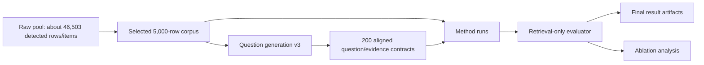

# Layer 2 Cross-Domain Benchmarks

Layer 2A is ChronoRAG's controlled cross-domain retrieval-only benchmark. It
checks selected evidence behavior across a selected 5,000-row corpus and 200 v3
aligned questions. The public retrieval-only path reports selected-evidence
metrics without provider-backed answer synthesis.

The Layer 2A artifacts provide controlled benchmark evidence for temporal
retrieval behavior under explicitly scoped datasets and validators. Their
measurement contract is retrieval-only evidence selection in this tested
setting.

Layer 2B is the companion full-50 natural-language temporal QA evaluation. It
uses manually designed temporal QA cases, ChronoRAG answer synthesis, hard
answer-contract validation, LLM judge scoring, and a manual audit note.
Layer 2B measures answer synthesis and answer validation; Layer 2A carries the
selected-evidence retrieval metrics.

## Layer 2A Flow



## Corpus And Question Files

Layer 2A distinguishes tracked sample data from generated or working benchmark
data:

| Path | Role |
|---|---|
| `benchmarks/layer2_crossdomain/data/raw_pool_manifest.json` | Records the measured raw-pool scale: 46,503 detected rows/items across five source families. |
| `benchmarks/layer2_crossdomain/data/layer2_corpus.sample.jsonl` | Small tracked sample corpus for plumbing tests and public inspection. |
| `benchmarks/layer2_crossdomain/data/layer2_corpus.jsonl` | Full generated/working 5,000-row corpus used during benchmark execution. It may be generated or carried in working environments and is not the same as the smaller public sample. |
| `benchmarks/layer2_crossdomain/data/layer2_questions.jsonl` | Final 200-question v3 aligned benchmark file. |
| `benchmarks/layer2_crossdomain/generate_layer2_questions_v3.py` | Evidence-card-first question builder for the v3 contracts. |
| `benchmarks/layer2_crossdomain/validate_layer2_dataset.py` | Dataset and question-contract validator. |

The larger raw pool included FRED macro, market/index, SEC submissions, Federal
Register, and GitHub release rows/items. The final controlled benchmark uses a
selected 5,000-row cross-domain corpus rather than the full raw pool.

## V3 Question Categories

The v3 benchmark uses 20 questions per category:

| Category | Role | Scoring Status |
|---|---|---|
| `exact_valid_time_retrieval` | Retrieve evidence for an explicit valid date. | Scored category-primary retrieval case. |
| `same_entity_wrong_time_trap` | Retrieve the target date while excluding nearby same-entity same-metric dates. | Scored category-primary retrieval case. |
| `valid_time_vs_transaction_time` | Prefer fact time over filing/publication/release/transaction time when valid time is requested. | Scored category-primary retrieval case. |
| `cross_domain_temporal_comparison` | Cover both sides of a cross-domain comparison. | Scored category-primary retrieval case. |
| `source_specific_exact_time` | Satisfy source-family or source-reference constraints at an exact time. | Scored category-primary retrieval case. |
| `metric_specific_exact_time` | Satisfy metric, claim, or version constraints at an exact time. | Scored category-primary retrieval case. |
| `exact_vs_broad_temporal_preference` | Prefer exact valid-time evidence over broad/background or transaction-only rows. | Scored category-primary retrieval case. |
| `multi_slot_temporal_coverage` | Retrieve evidence for every requested temporal slot. | Scored category-primary retrieval case. |
| `partial_or_insufficient_evidence` | Surface partial/insufficient evidence behavior when exact valid-time evidence is not present. | Diagnostic in retrieval-only evaluation; answer semantics are for Layer 2B. |
| `ambiguous_time_query` | Represent ambiguous temporal targets without assigning a hidden exact row. | Diagnostic in retrieval-only evaluation; answer semantics are for Layer 2B. |

The evaluator keeps generic Hit@k for visibility, but the category-primary
metric is the meaningful Layer 2A check because some categories require
forbidden-evidence avoidance, slot coverage, source constraints, or metric
constraints rather than a single expected ID.

`conflict_detection` is outside the scored v3 categories because the current
corpus lacks real two-sided contradiction pairs. Explicit temporal
contradiction modeling is tracked as a technical extension rather than scored
over synthetic placeholders.

## Methods

Active public retrieval methods and baselines in the paper-ready standard
comparison:

- BM25
- Dense-only
- Date-filter RAG
- Metadata Temporal RAG
- ChronoRAG Full

`direct_llm_full_context` remains available for older diagnostics in the runner,
but it is not an active Layer 2A retrieval baseline for the public v3 result.

## Final Public Artifacts

The public Layer 2 result directory contains:

- `results/README.md`
- `results/layer2_retrieval_only_v3_200_eval.md`
- `results/layer2_retrieval_only_v3_200_eval.json`
- `results/layer2_ablation_v3_ablation200.md`
- `results/layer2_ablation_v3_ablation200.json`
- `results/layer2b_manual_50_qa_summary.md`
- `results/layer2b_chronorag_full_layer2b_full50_vertex_final_results.md`
- `results/layer2b_judge_layer2b_full50_judge_final_results.md`
- `results/layer2b_full50_manual_audit.md`
- `results/.gitkeep` if needed

Archived intermediate artifacts belong in `results/archive/`. Those include
older category-aware reports, Vertex smokes, answer-contract pilots, and debug
runs that are useful for audit history but are not the final Layer 2A v3
retrieval-only result or the final Layer 2B full-50 answer-validation result.

## Retrieval-Only Result

Stored report:

- [`results/layer2_retrieval_only_v3_200_eval.md`](results/layer2_retrieval_only_v3_200_eval.md)

Summary:

| Method | Cases | Hit@1 | Hit@5 | MRR@5 | Forbidden Absent@5 | Category Primary Pass |
|---|---:|---:|---:|---:|---:|---:|
| BM25 | 200 | 0.7750 | 0.9350 | 0.8467 | 0.7600 | 0.5750 |
| Dense-only | 200 | 0.3850 | 0.6100 | 0.4710 | 0.7950 | 0.3000 |
| Date-filter RAG | 200 | 0.7750 | 0.9350 | 0.8475 | 0.7650 | 0.6000 |
| Metadata Temporal RAG | 200 | 0.6900 | 0.8600 | 0.7678 | 0.6950 | 0.4813 |
| ChronoRAG Full | 200 | 0.8250 | 0.8950 | 0.8554 | 0.9950 | 0.9625 |

This report scores each method's `selected_evidence_ids`. Prompt previews and
dry-run answer placeholders are not answer-quality measurements.

BM25 and Date-filter RAG have higher broad Hit@5 than ChronoRAG Full, but
ChronoRAG Full has stronger Hit@1, MRR@5, Forbidden Absent@5, and Category
Primary Pass. The result should be read as evidence for temporal-validity
retrieval, not as a claim that ChronoRAG maximizes broad retrieval recall.

Metric definitions:

- Hit@k is the fraction of cases where at least one expected or acceptable
  evidence ID appears in the top-k selected evidence set.
- MRR@5 is the mean reciprocal rank of the first expected or acceptable
  evidence ID within top-5.
- Forbidden Absent@5 is the fraction of cases where forbidden evidence IDs are
  absent from top-5.
- Category Primary Pass is the category-specific diagnostic for temporal,
  source/metric, slot, forbidden-evidence, or insufficiency behavior.

Forbidden Absent@5 and Category Primary Pass are constraint-sensitive
diagnostics for temporal-validity retrieval. They are not intended to replace
standard IR metrics; they complement Hit@k and MRR@5 by measuring
temporal-invalidity exclusion and source/category correctness.

The current artifact records benchmark labels as fixed JSONL fields. The
labels are author-created and treated as fixed before method scoring.
Large-scale independent annotation is not included in this version and is
listed as a limitation. Standard comparisons use the same corpus, same
queries, same top-k=5, same evaluator, and same candidate corpus where
applicable.

## Layer 2B Full-50 Answer Validation

Dataset and execution paths:

- Dataset: `data/layer2b_manual_50_qa.jsonl`
- Dataset validator: `validate_layer2b_manual_qa.py`
- Answer runner: `run_layer2b_manual_qa.py`
- Judge runner: `run_layer2b_judge.py`

Final artifacts:

- `results/layer2b_manual_50_qa_summary.md`
- `results/layer2b_chronorag_full_layer2b_full50_vertex_final_results.md`
- `results/layer2b_judge_layer2b_full50_judge_final_results.md`
- `results/layer2b_full50_manual_audit.md`

Final full-50 scores:

| Layer 2B metric | Score |
|---|---:|
| Deterministic hard-contract pass | 38 / 50 = 76% |
| LLM judge overall pass | 38 / 50 = 76% |
| LLM judge semantic pass | 48 / 50 = 96% |
| Strict combined pass | 35 / 50 = 70% |
| Manually accepted validator-strictness cases | 3 |
| Manual-audited acceptable pass | 41 / 50 = 82% |

The strict combined pass is the conservative score. The manual-audited
acceptable pass is a secondary audit interpretation after accepting 3 cases
where hard validation failed but judge and manual review agreed the answer was
semantically correct. The final full-50 answer and judge runs had 0 answer
provider errors, 0 judge errors, 0 judge provider failures, and 0 judge parse
failures.

Layer 2B is an answer-synthesis and answer-validation evaluation. Retrieval
quality is reported through the Layer 2A selected-evidence metrics.

BM25 + LLM, Dense-only + LLM, and Date-filter RAG + LLM were evaluated with
the same 50 QA cases, same corpus, same top-k=5, same Gemini 2.5 Flash model,
same temperature 0.0, same prompt template, and same validator/judge settings.
Despite explicit instructions to distinguish valid time from transaction time,
these baselines reached only 0.4000, 0.3200, and 0.4000 strict combined pass
respectively. ChronoRAG Full's prior answer-level result reached 0.7000 strict
combined pass, 0.7600 hard-contract pass, 0.9600 judge semantic pass, 0.9800
expected evidence citation, and 0.8400 valid-time correctness.

Baseline methods are evaluated without evidence injection. ChronoRAG
pre-injection evidence availability is the fair retrieval-availability
comparison point. ChronoRAG post-injection answer-level results are reported
separately to show performance when expected evidence is available to the
generator. In the extracted QA50 artifacts, pre-injection any expected evidence
is 0.7400 (37/50), pre-injection all expected evidence is 0.6400 (32/50), and
post-injection evidence available is 1.0000 (50/50). Gold expected evidence
IDs were not included in the LLM baseline prompts.

## Ablation Result

Stored report:

- [`results/layer2_ablation_v3_ablation200.md`](results/layer2_ablation_v3_ablation200.md)

Ablation variants:

| Variant | What It Removes Or Changes |
|---|---|
| `chronorag_full` | Full ChronoRAG retrieval and finalization path. |
| `chronorag_no_tcc` | Disables Temporal Contextual Chunking retrieval text. |
| `chronorag_no_temporal_precision` | Disables temporal precision scoring and exact negative-date suppression. |
| `chronorag_no_transaction_role` | Disables valid-time versus transaction-time cleanup in finalization. |
| `chronorag_no_source_metric` | Disables source and metric adjustment in finalization. |
| `chronorag_no_slot_assembler` | Disables slot-aware assembly for comparison and multi-slot questions. |
| `chronorag_score_only` | Uses fused scores without the finalization components. |
| `metadata_temporal_rag` | Metadata-oriented temporal retrieval baseline. |

Overall ablation summary:

| Variant | Cases | Generic Hit@1 | Generic Hit@5 | Forbidden absent@5 | Category primary pass |
|---|---:|---:|---:|---:|---:|
| `metadata_temporal_rag` | 200 | 0.6900 | 0.8600 | 0.6950 | 0.4813 |
| `chronorag_score_only` | 200 | 0.8150 | 0.9850 | 0.6500 | 0.5625 |
| `chronorag_no_tcc` | 200 | 0.8350 | 0.8950 | 0.9950 | 0.9625 |
| `chronorag_no_temporal_precision` | 200 | 0.7500 | 0.8500 | 0.9450 | 0.7500 |
| `chronorag_no_transaction_role` | 200 | 0.8250 | 0.8950 | 0.9950 | 0.9625 |
| `chronorag_no_source_metric` | 200 | 0.8300 | 0.8900 | 1.0000 | 0.9688 |
| `chronorag_no_slot_assembler` | 200 | 0.8300 | 0.8900 | 0.8150 | 0.7750 |
| `chronorag_full` | 200 | 0.8250 | 0.8950 | 0.9950 | 0.9625 |

### Retrieval Score Optimization Degrades Temporal Validity

The Score-only ablation achieved the highest raw Hit@5 at 0.9850, but
Forbidden Absent@5 fell to 0.6500 and Category Primary Pass fell to 0.5625.
ChronoRAG Full achieved lower broad Hit@5 at 0.8950 but much stronger
Forbidden Absent@5 at 0.9950 and Category Primary Pass at 0.9625. This
demonstrates that unconstrained retrieval score optimization and
temporal-validity retrieval are different objectives.

Interpretation should stay conservative. Some categories are explicitly
anchored enough that an ablation may not drop, and that is a property of this
controlled benchmark design rather than a conclusion about the removed
component across other settings.

## Benchmark Corrections And Failure Notes

- Broad-window style questions were corrected because vague year-only wording
  cannot fairly require a hidden exact date.
- Conflict detection was removed from scored v3 categories because real
  paired contradiction rows are absent in the current corpus.
- Layer 2A is retrieval-only; Vertex and LLM judge artifacts are not the final
  public result for this layer.
- The current v3 benchmark aligns question wording, expected evidence, and
  available corpus rows more strictly.
- The correction made the benchmark contract stricter rather than hiding
  failures.

## Reproduce

Layer 2A dataset validation:

```bash
python3 benchmarks/layer2_crossdomain/validate_layer2_dataset.py \
  --corpus benchmarks/layer2_crossdomain/data/layer2_corpus.jsonl \
  --questions benchmarks/layer2_crossdomain/data/layer2_questions.jsonl
```

Exact 200-case retrieval comparison:

```bash
python3 benchmarks/layer2_crossdomain/run_layer2_comparison.py \
  --method all \
  --mode dry_run \
  --dataset real \
  --limit 200 \
  --top-k 5 \
  --result-suffix v3_200

python3 benchmarks/layer2_crossdomain/evaluate_retrieval_only.py \
  --results benchmarks/layer2_crossdomain/results/layer2_chronorag_full_v3_200_results.json \
            benchmarks/layer2_crossdomain/results/layer2_metadata_temporal_rag_v3_200_results.json \
  --questions benchmarks/layer2_crossdomain/data/layer2_questions.jsonl \
  --save-json benchmarks/layer2_crossdomain/results/layer2_retrieval_only_v3_200_eval.json \
  --save-md benchmarks/layer2_crossdomain/results/layer2_retrieval_only_v3_200_eval.md
```

Exact 200-case ablation:

```bash
python3 benchmarks/layer2_crossdomain/run_layer2_ablations.py \
  --corpus benchmarks/layer2_crossdomain/data/layer2_corpus.jsonl \
  --questions benchmarks/layer2_crossdomain/data/layer2_questions.jsonl \
  --mode dry_run \
  --limit 200 \
  --top-k 5 \
  --result-suffix v3_ablation200
```

Provider-backed natural-language temporal QA belongs to Layer 2B
answer-validation work, not to the Layer 2A retrieval-only report.

Paper-ready comparison tables, Wilson confidence-interval variants, QA50
extracted values, top-k sensitivity, and not-run validation notes are indexed
at `docs/paper_assets/chrono_tables_index.md`.
