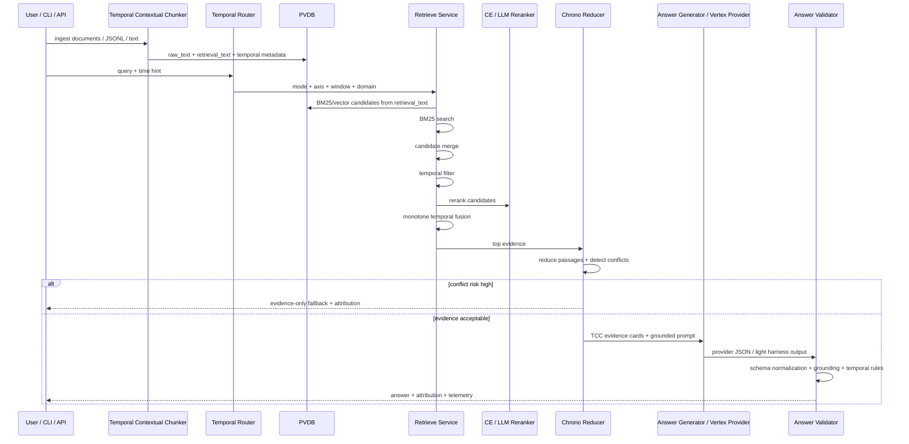

# ChronoRAG Architecture

ChronoRAG is organized around one core pipeline:

```text
ingest -> Temporal Contextual Chunking -> PVDB/BM25/vector index -> route query -> retrieve -> temporal filter -> temporal fusion -> ChronoSanity -> grounded synthesis -> schema/grounding/temporal validation -> attribution/answer
```

## Main Layers

### 1. API Layer: `app/`

The API layer exposes FastAPI routes and wires service dependencies.

Key responsibilities:

- Accept ingest, retrieve, answer, policy, and incident requests.
- Convert request payloads into service calls.
- Return structured answer envelopes with attribution and controller telemetry.

### 2. Service Layer: `app/services/`

The service layer contains the project’s main behavioral logic.

| Service | Responsibility |
|---|---|
| `ingest_service.py` | Loads JSONL/text, applies Temporal Contextual Chunking, derives metadata, and writes chunks into PVDB. |
| `retrieve_service.py` | Runs hybrid retrieval, temporal filtering, reranking, and fusion. |
| `answer_service.py` | Orchestrates routing, retrieval, conflict detection, generation, and fallback. |
| `policy_service.py` | Handles runtime policy configuration. |
| `incident_service.py` | Handles incident/maintenance reporting paths. |

### 3. Core Reasoning Layer: `core/`

The core layer holds reusable research modules.

| Module | Responsibility |
|---|---|
| `core/router/` | Converts query + time hints into mode, axis, domain, and target window. |
| `core/dhqc/` | Plans retrieval hops from coverage/authority signals inside answer orchestration. This is active, but auxiliary to the main TCC plus retrieval path. |
| `core/retrieval/` | BM25, cross-encoder, and LLM judge retrieval components. |
| `core/generator/` | Prompt construction, backend selection, structured answer generation. |

### 4. Storage Layer: `storage/`

Storage currently supports local/research persistence and cache-oriented helpers.

| Module | Responsibility |
|---|---|
| `storage/pvdb/` | Persistent vector DB abstraction, chunk models, DAO. |
| `storage/cache/` | Redis-backed cache/freshness hooks. |
| `storage/graph/` | Graph-oriented storage experiments. |

`core/retrieval/graph_paths.py` is currently a stub that raises
`GraphNotConfigured`. Graph retrieval is outside the active Layer 1B execution
path until a graph backend and path-ranking policy are configured.

## Temporal Concepts

### Temporal Contextual Chunking

Temporal Contextual Chunking is ChronoRAG's chunking strategy. It is inspired by
contextual retrieval, but extends that idea for valid-time retrieval,
transaction-time tracking, temporal fusion, ChronoSanity, and attribution.

Each chunk should keep unchanged `raw_text` for attribution and answer grounding
while using a separate `retrieval_text` for BM25/vector indexing. The retrieval
text can include short global context such as document title, section, unit,
entity, region, and temporal scope. Temporal metadata should record valid time,
transaction time, granularity, source of the time signal, confidence, and
ambiguity.

The key rule is that context must never overwrite raw evidence. Publication time
belongs to transaction time unless the source explicitly supports it as
claim-valid time. Broad windows are useful background, but exact-year chunks
should rank higher for exact-year queries when evidence quality is comparable.

### Valid Time

The period during which a claim is true in the real world.

Example: a GDP estimate for 1870 has valid time around 1870, even if published later.

### Transaction Time

The period during which the system knew or stored a claim.

Example: an estimate added in 2024 has transaction time beginning in 2024.

### Axis

The time dimension used for query enforcement.

- `valid`: retrieve evidence true during the requested real-world period.
- `tx`: retrieve evidence known/stored during the requested system period.

### Mode

The strictness level for temporal matching.

- `HARD`: strict window adherence.
- `INTELLIGENT`: allows controlled decay outside the requested window.
- `LIGHT`: lightweight testing/smoke mode.
- `FULL`: full model-backed run.

## Retrieval Flow



## Design Strengths

- Temporal information is enforced before final ranking, not added only after answer generation.
- Chunk records are designed to separate raw evidence from retrieval context.
- Retrieval uses lexical and vector channels instead of only embeddings.
- Ranking includes authority, temporal alignment, age penalty, and unit/domain biases.
- The answer path includes conflict detection and degradation logic.
- Provider-backed answer validation separates provider-output contract failures
  from grounding and temporal-rule failures.
- The response envelope exposes telemetry that can become an evaluation/observability layer.

## Architecture Extension Points

- Robust temporal expression normalization for relative, fuzzy, implicit, and
  underspecified dates.
- Learned temporal reranking over semantic relevance, valid-time fit,
  transaction-time role, interval overlap, and forbidden-time penalties.
- Multi-hop temporal reasoning over ordered evidence chains.
- Explicit temporal contradiction modeling with contradiction type and severity
  classification.
- Calibrated temporal confidence estimation for evidence fit, conflict
  likelihood, and answer validity.
- Joint optimization of temporal fusion and source-aware, metric-aware, and
  slot-aware evidence finalization.
- Broader interpretability tooling for additional temporal score heatmaps,
  evidence-ranking traces, attribution-flow graphs, and before/after
  finalization visualizations.
- Graph retrieval integration once graph storage, path ranking, and evaluation
  contracts are defined.
