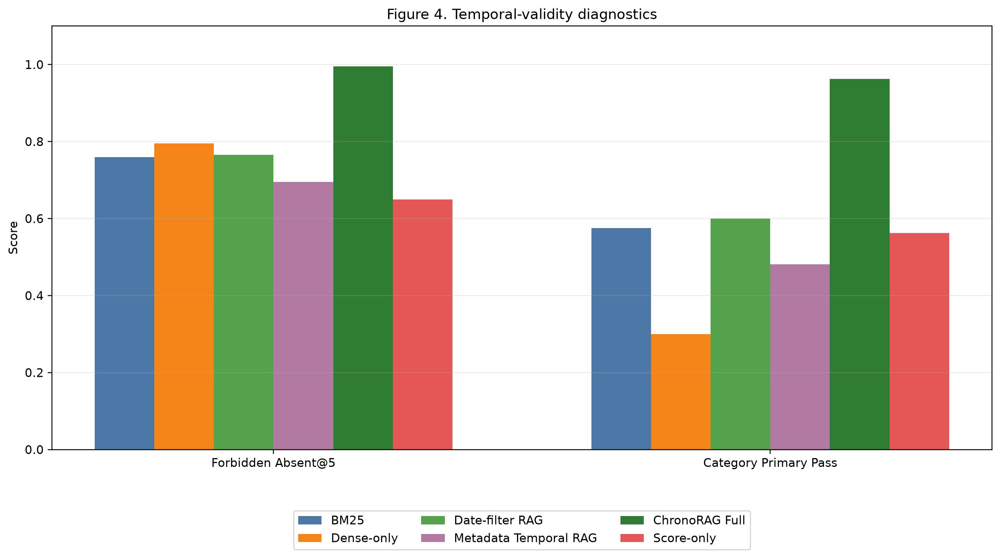
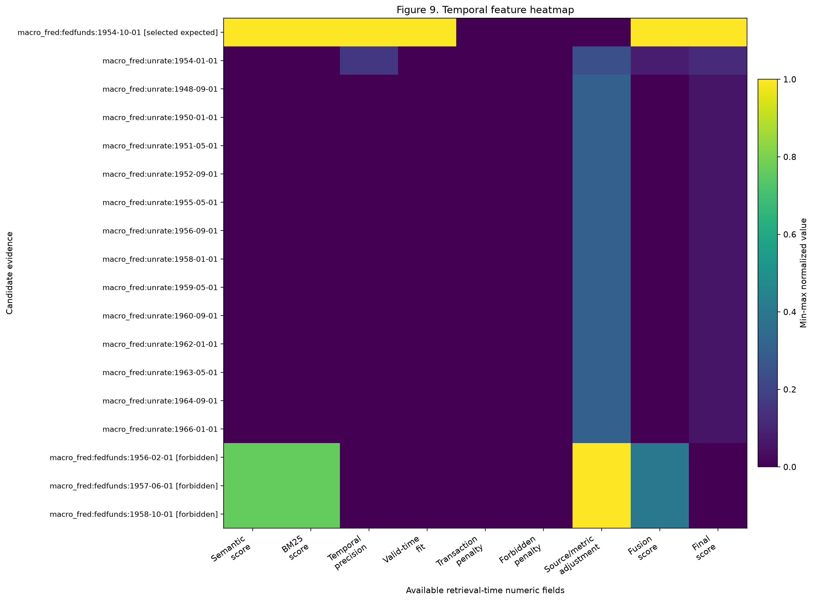
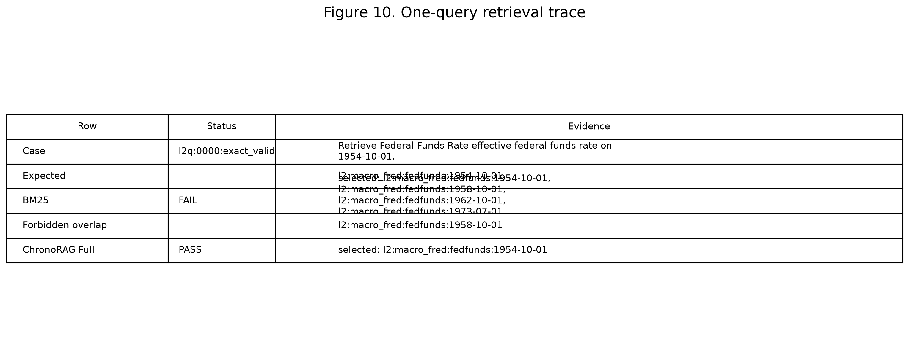
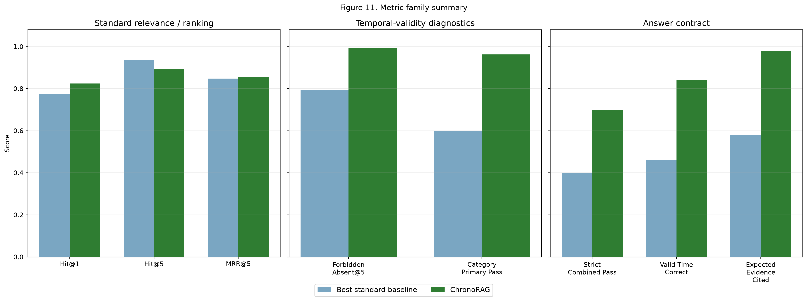

# Figures

Place figures next to the claims they support: Figure 1 near the temporal
misgrounding motivation, Figure 2 near the architecture, Figures 3-5 near
Layer 2A retrieval and ablation results, Figure 6 near QA50 post-filtering,
Figure 9 near trace/mechanism discussion, and Figure 10 near qualitative
retrieval examples, and Figure 15 near runtime/latency discussion.
Quantitative charts are generated from existing result artifacts; conceptual
figures are labeled as schematics.
